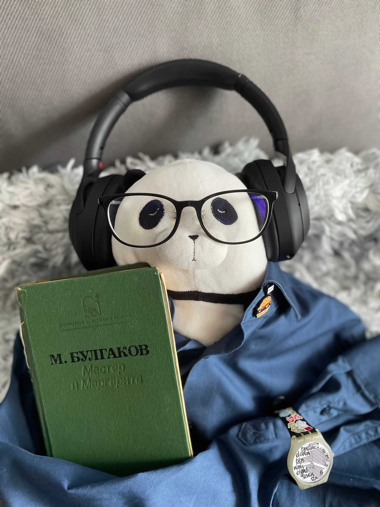

Our first creative assignment was to put together a self–portrait using objects of meaning found in the room or around us. 

I got extremely excited after seeing the avatars of Morwenna and Richard. Not only were the avatars brilliantly composed, but the stories that accompanied them were deeply personal, demonstrated passion and enthusiasm.

I started by analysing the challenge brief, and I came to an understanding that in order to express myself through an avatar, I had to follow Giuseppe Arcimboldo's guidance and find a way to represent my body's affinity with my nature. The nature of digital and analogue, of order and chaos. I put together a mood board, and went as far in my discovery as including the works of Peter Daverington, which even made me think of taking a less traditional approach and depicting myself in a more abstract fashion.

My composite face is that of a Panda — a toy I bought in my first week abroad, in Shanghai, more than 5 years ago. My dearest plush friend, he's been travelling with me ever since — from the Philippines' shores to the Malaysian slums. He rules over the others, which we happen to have many purchased over the years, and his personality, clearly expressed on his indifferent and slightly irritated face, matches mine perfectly well. You can see him wearing my spectacles and headphones, two things I barely part ways with.

The body, however, does not belong to the panda: it comprises a bag of empty aluminium cans (apparently, depicting my passion for soft drinks and recycling?) and a formal shirt with the top button unbuttoned — another thing I do, trying to find and maintain the semi–perfect balance between looking too formal and too casual, especially on camera. 

You may have noticed the watch: just like his prototype, the panda keeps an eye on the clock, knowing well enough that every minute counts. One might say, he is obsessed with control. The book: he is holding up to my table read, the book I've been carrying around for over a decade: "The Master and Margarita", a novel by Russian writer Mikhail Bulgakov. Written in the Stalinist Soviet Union, it so happens to feature a character taken away by demons: his suit, however, remained in the office and kept working as if nothing had happened. Finally, a tiny burger badge represents my utterly destructive passion for comfort food.

It did not take me long to find the composition that would retain the message and comprise all the elements I was so eager to include, to make sure it looks just like me, has a dash of my soul in it. Looking back at the process, I now realise that discovery was the detrimental step in the creative process: identifying the right objects, putting together the story, and finding the inspiration helped me come up with the composition. The most challenging aspect was the process of taking a photo — as a note to self, I would advise to purchase some basic equipment (light, at the very least) — to ease the process for the upcoming assignments.