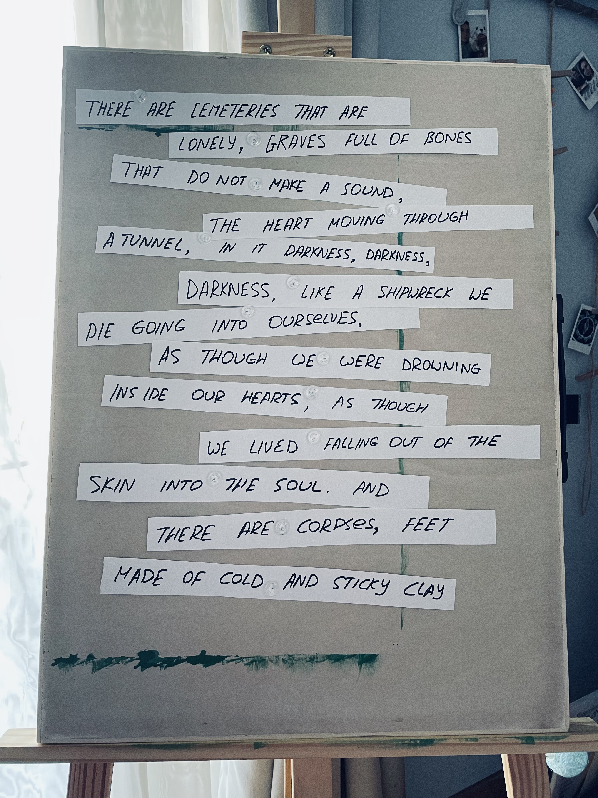
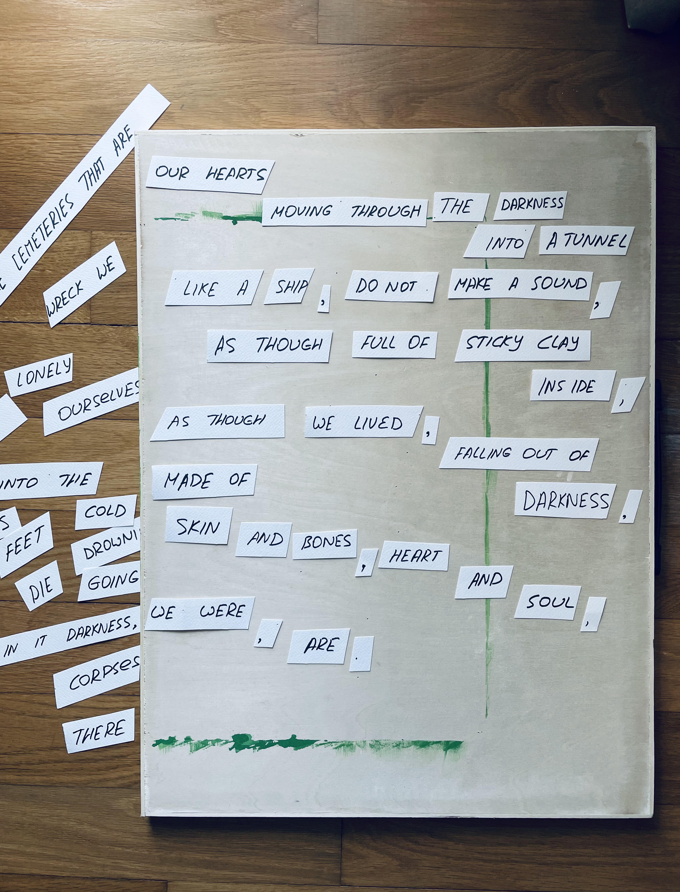

This week, we were tasked to remediate an existing artefact into something new. For this creative challenge, I decided to employ David Bowie's favourite methods of cut–ups, mixed with an opposite thinking. I've been writing poetry for ages, I recently started publishing poems in English, so it was a fruitful exercise not only in applying creative thinking, but in writing poetry, too. 

I picked the first stanza of one of the darkest poems I know and love — Pablo Neruda's "Nothing But Death" — and used it as a basis for my micro–poem. Since the tone of the original is rather grim, it completely lacks any reminiscence of positivity and cheerfulness, I thought it would be a good challenge to transform it into something completely opposite. 

The original poem begins at the lonely cemetery where graves, full of bones, are mute, and hearts move into the darkness. It is void of light and motion: the speaker feels as if they were trapped, drowning inside their hearts, falling out of the skin, surrounded by corpses made of cold clay. How do you even make it sound less gloomy without a single noun or a verb suggesting there could be hope, love, warmth?

I decided against using computer programme, as it felt less personal, intimate than working with the real objects. I cut Neruda's original poem freely, and used the words from it to assemble a brand-new work.

My new poem, born out of Neruda's dark imagery, features an exact opposite sensation: in it, everything is set in motion, and the hearts are moving through the darkness into the light (assumed). The speaker doesn't feel alone any more: they speak highly of the life they had lived ("falling out of darkness"), accept that although they were made of "skin and bones", they were also "heart and soul", proclaim that they were and (always) are. It seems like they are still dying — however, unlike Neruda's characters, mine move happily towards the light.

I have learnt that opposite thinking could be a powerful tool: having an opposite point of view helps rethink and reassess the initial notion, take a better look at what seemed obvious at a first glance. Cut–ups help boost the creativity, move it to another level: restricted to a predefined set of assets, you start thinking outside the box, and the more challenging your initial position is ("it's impossible"), the more creative you get to reach the desired outcome.