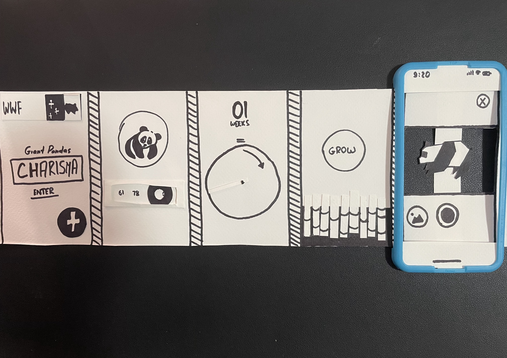
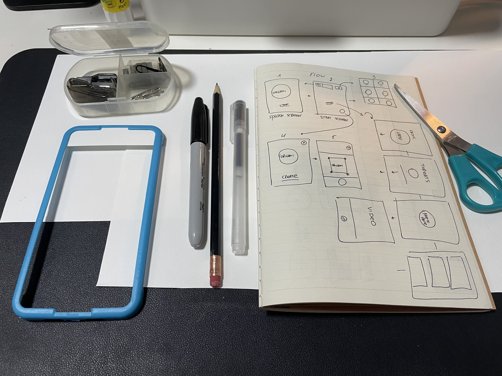

For this week's creative challenge, I decided to reserve–engineer one of my favourite mobile application — the WWF's "Together" — using simple prototyping techniques.

Reading of paper prototyping, storyboarding, and wireboarding, I decided to employ one of those in my process. With the recent switch into remote delivery, I couldn't help by sense that the usage of paper prototypes has depleted tremendously. I couldn't recall the last time I used it for the UX project, so this exercise was a good chance for me to practice the long–forgotten craft.

I started by researching the app, listing out the features, and outlining the user flow for the prototype. Furthermore, I decided to focus on the main journey where the customer launches the application, clicks through the informative screens, and proceeds to placing an origami animal in his surroundings using the phone's camera.

I wanted the experience to be immersive, despite using simple tools, so I used the screen protector placement frame to imitate an iPhone. I cut the chrome and attached it to the "device", and left the "railing" to make sure I can smoothly switch between screens, as seen on the GIF below.

I used a standard printing paper at first, but it didn't provide enough durability and felt too light–weight, so I replaced it with a more dense watercolour paper.

<iframe src="https://player.vimeo.com/video/629105322?h=9a18c1a72f&amp;badge=0&amp;autopause=0&amp;player_id=0&amp;app_id=58479" frameborder="0" allow="autoplay; fullscreen; picture-in-picture" allowfullscreen style="position:absolute;top:0;left:0;width:100%;height:100%;" title="03-panda.mov"></iframe>

I then split the "screen roll" into sections and cut some elements out to give it the sense of depth. I have often heard of people not willing to use paper prototypes due to the lack of fidelity, so I went the extra mile to enable some interactivity. Here, you can see the toggle switch, imitating the actual toggle in the real application.

For the final twist, I decided to enable even more interactivity, and cut out a tiny figurine that would be "placed" in the real world by the user. The cut–out with a figuring ensures the user's experience is as genuine as possible.

<iframe src="https://player.vimeo.com/video/629106164?h=c20dfcd4c7&amp;badge=0&amp;autopause=0&amp;player_id=0&amp;app_id=58479" frameborder="0" allow="autoplay; fullscreen; picture-in-picture" allowfullscreen style="position:absolute;top:0;left:0;width:100%;height:100%;" title="03-slider.mov"></iframe>

Overall, it was a fun, but meaningful experience. I have uncovered some rather unusual mechanics in the app. I have looked at it from the 3–dimensional perspective while cutting out the buttons, helping me understand how the elements will be placed in the final design and build. Finally, I have tried to elevate the experience using the paper prototype, which I would absolutely love to try once more, when the collaboration in the real world is made possible again.