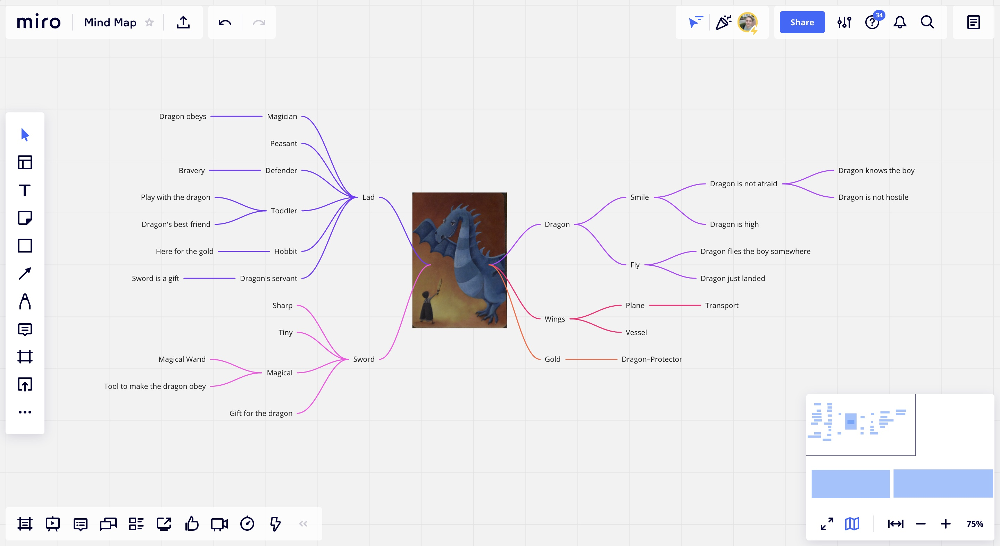

A few days ago at the webinar, we received this week's prompt: a surrealist Dixit card and a random news article. 

I decided to spend some time brainstorming the idea: although the first look at the image already gave me the initial direction, I needed to refine it further. I used Miro board for the ideation session, although for the prototyping itself, I decided to stick to the analogue tools and handle the task using paper and sharpies only. I also decided to add a "Protip" diversifier and sleep well every day during the rapid ideation weeks!

I used mind–mapping technique to explore the topics of the image first. I felt a tad overwhelmed with the amount of information that started popping into my head as I was looking at the card, so mind-mapping — the tool specifically designed to transform lists of unstructured information (Luenendonk 2019) — seemed like a perfect fit.

I set the limit to 5 minutes, and during the mind storming, I came up with a set of keywords (and phrases) I would use to produce the concept. 

Some of the ideas that came into my mind:

- The dragon doesn't look hostile. They are smiling and waving, as if greeting the child;
- The child may have wielded the sword to draw dragon's attention, not to fight;
- Given that, the dragon might be there to take the child some place else.

I researched the news and came across an interview with Stephen Fitzpatrick, founder and CEO of Britain's Vertical Aerospace, who believes that flying taxies might finally "take off" in mid-2020s (Young 2021). 

What if I were to design a flying taxi hailing app (Grab/Uber for air taxis) for the future where such transportation is made possible? Most likely, flying taxis will be pilot–free, so the rider will be able to change the destination mid–flight. Air taxis are meant to be an eco–friendly alternative to their traditional counterparts, so I would need to emphasise the positive impact, inspire people to learn about climate change and take environmental action ("Eco action" diversifier added!). 

I might slightly change or tweak the topic as I start exploring it (most likely, I will begin with a little brainstorm and Crazy 8-s), but it is definitely going to be a lot of fun!

---

#### References

LUENENDONK, M. 2019. ‘Techniques for Idea Generation: Mind Maps’. _Cleverism_. Available at: [https://www.cleverism.com/techniques-idea-generation-mind-maps](https://www.cleverism.com/techniques-idea-generation-mind-maps) [accessed 15 Nov 2021].

YOUNG, Sarah. ‘Flying Taxis to Take to the Sky in Mid-2020s, Says UK’s Vertical Aerospace’. 2021. _MSN_ [online]. Available at: [https://www.msn.com/en-ca/money/topstories/flying-taxis-to-take-to-the-sky-in-mid-2020s-says-uk-s-vertical-aerospace/ar-AAPsFlL](https://www.msn.com/en-ca/money/topstories/flying-taxis-to-take-to-the-sky-in-mid-2020s-says-uk-s-vertical-aerospace/ar-AAPsFlL) [accessed 15 Nov 2021].