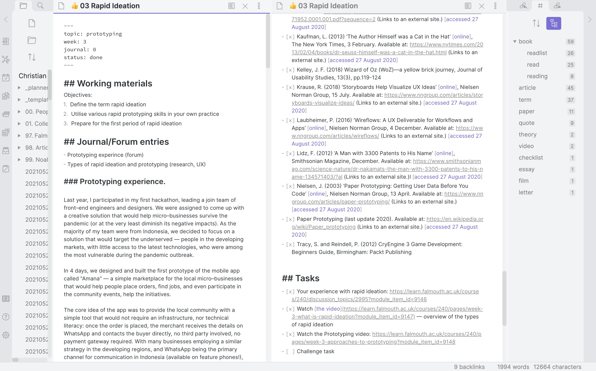

## Analysing the journal 

As part of this week's practice, we were tasked to evaluate our creative reflective journals and assess which domains appear more often in the journal entries. 

Alcwyn Parker describes five primary reflective domains:

- **Dispositional**: time–management, motivation, behaviour, and discipline;
- **Affective**: understanding the emotions, evaluates how external factors can influence the progress;
- **Interpersonal**: all the skills required to interact with others — verbal and other communication, listening, decision-making, assertiveness;
- **Cognitive**: assess the strengths and weaknesses of the approach to learning;
- **Procedural**: understand current skills, find the room for improvement.

import JournalChart from "../../src/components/charts/JournalEntries.js"

<JournalChart />

In my first entry, [[2021-09-19 On Reflective Writing|On Reflective Writing]], I pointed out how the process of using reflection to evaluate the learning progress was not new to me — however, writing publicly has made me be more critical towards my experience. Before writing an entry, I started asking myself: have I learnt anything new? What has changed in my perception? Is there any way I can apply this knowledge?

**Dispositional** entries make frequent appearance in my journal: I talked about time management and discipline ([[2021-09-24 Agile Development Practices|Agile Development Practice]], [[2021-10-14 On Managers and Producers|On Managers and Producers]]), and planning to make a few more entries this week, in particular on how my approach to documenting my experiences and planning the future activities has altered throughout the duration of the course.

**Affective entries**, however, barely made it into my journal: I mentioned how anxious I was about starting a public journal ([[2021-09-19 On Reflective Writing|On Reflective Writing]]), and how my personal emotions and prejudices impact my perception ([[2021-09-27 Computational Creativity|Computational Creativity]]). I am planning to start discussing my emotional state, especially given how I have not been in the best place recently and struggled with mental health issues.

Being a Design Lead, I always pay attention to how my **interpersonal** domain is improving: for instance, learning about [[2021-10-14 On Managers and Producers|Managers and Producers]] helped my reshape the role of my project manager and include him in more design decisions, which significantly improved the output of our works last week. I am seriously rethinking my approach to planning ([[2021-09-24 Agile Development Practices|Agile Development Practice]]) and how I communicate with the team. 

**Cognitive** domain appears in the challenges I complete — from making an [[2021-09-20 Avatar Through Objects|Avatar Through Objects]] to [[2021-10-15 Rapid Ideation Session Kick Off|Rapid Ideation Session Kick Off]]. Experts are made through tailored challenges that make them feel uncomfortable, but don't overwhelm them (Ericsson, Prietula, Cokely 2007) — so I try to learn new skills every time. However, I feel like I do not pay enough attention to focusing on a particular set of skills I want to improve or gain — in the future, I should spend more time benchmarking my current self against the past.

Finally, **procedural** domain is present in almost every entry of my journal — I attempt to evaluate every experience from the perspective of understanding my current skills and knowledge and identifying the room for improvement. 

I can clearly see the benefits of reflecting upon my experience. I became more critical towards my learning, started evaluating how what I learn can be applied in my work and personal life. There is still room — for instance, I need to better plan my learning goals, find enough time for critical reflection, pay more attention to my emotional stability and well–being. 

From the practical standpoint, I shall alter the source code of this website and add the domains to every journal entry to ensure I maintain the balance. I shall also implement the counter to clearly see which domain should appear more often in my journal.

## SMART goals

As part of the assignment, I am tasked to set some SMART goals based on my most relevant journal entries. Setting SMART goals, I need to ensure they are specific, measurable, achievable, relevant, and time–bound. 

Applying the framework, I managed to create a few important goals (that are loosely bound to the journal entries) that I will attempt to reach:

### 1 — Improve the communication

In [[2021-09-19 On Reflective Writing|On Reflective Writing]], I wrote that I was anxious to publish my journal entries openly. I have now embraced the openness and shall move it to the next level and improve the way I communicate with my fellow coworkers. I shall publish the forum entries and make sure to respond to at least 3 posts every week throughout the entire duration of my studies. This will help me communicate better with the people I barely get to talk to, and help make new connections.

### 2 — Agilize my personal planning

In [[2021-09-24 Agile Development Practices|Agile Development Practices]], I wrote that I felt uncomfortable implementing the Agile methodologies in my personal planning. In fact, I have been very much rigit, especially when it comes to planning my activities for the learning modules. Here is how my weekly planner looks now — it practically leaves no room for flexibility and gives no space to navigate, restricts to a plan, and doesn't allow for sudden changes.

.

I shall implement a more flexible plan using Kanban with clear objectives and a roadmap, not bound by items in the to–do lists, but by achievable goals. I shall set up a planning board by the end of this sprint, and use it as a base for my personal learning planning. 

### 3 — Challenge myself

In [[2021-10-15 Rapid Ideation Session Kick Off|Rapid Ideation Session]], I mentioned that I wanted to try some new techniques for the prototyping. However, I set up a Trello board, and used Miro to brainstorm the initial idea. For the upcoming assignments of this module, I shall only use the software I am unfamiliar with. This way, I will manage to challenge myself, learn new things, master new techniques.

For this entry, for instance, I decided to use [Recharts Library](https://recharts.org) that I was not familiar with. Now, after implementing an interactive graph with it, I know how to utilise it in MDX, and will make sure to use it in my upcoming projects.

#### References

PARKER, Alcwyn. 2020. ‘Week 5: The Five Reflective Domains’ . _Canvas @ Falmouth University_. Available at: [https://learn.falmouth.ac.uk/courses/240/pages/week-5-the-five-reflective-domains?module_item_id=9166](https://learn.falmouth.ac.uk/courses/240/pages/week-5-the-five-reflective-domains?module_item_id=9166) [accessed 10/18/2021]

ERICSSON, K. Anders, Michael J. PRIETULA and Edward T. COKELY. 2007. ‘The Making of an Expert’. _Harvard Business Review_ [online]. Available at: [https://hbr.org/2007/07/the-making-of-an-expert](https://hbr.org/2007/07/the-making-of-an-expert) [accessed 18 Oct 2021].

‘SMART Goals: – How to Make Your Goals Achievable’. 2021. [online]. Available at: [http://www.mindtools.com/pages/article/smart-goals.htm](http://www.mindtools.com/pages/article/smart-goals.htm) [accessed 19 Oct 2021].