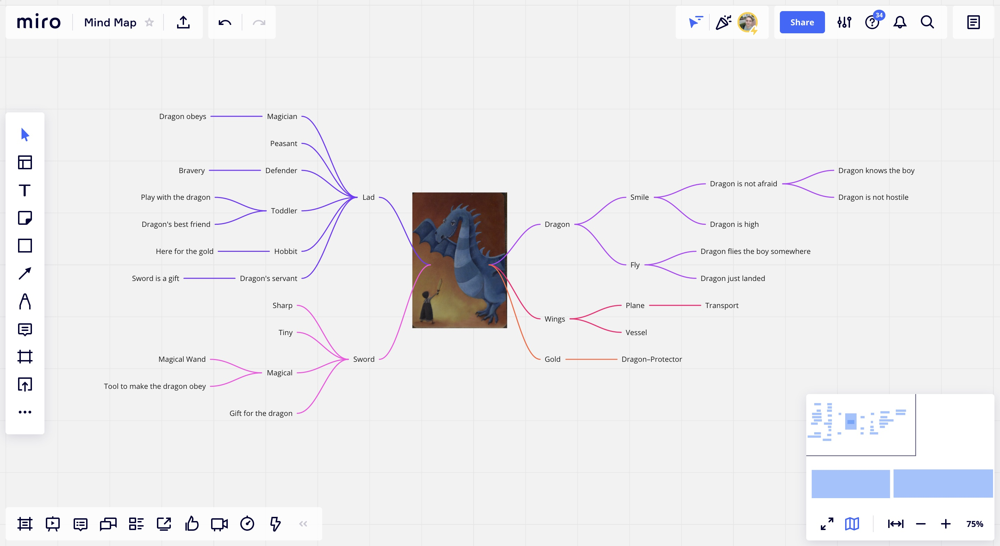
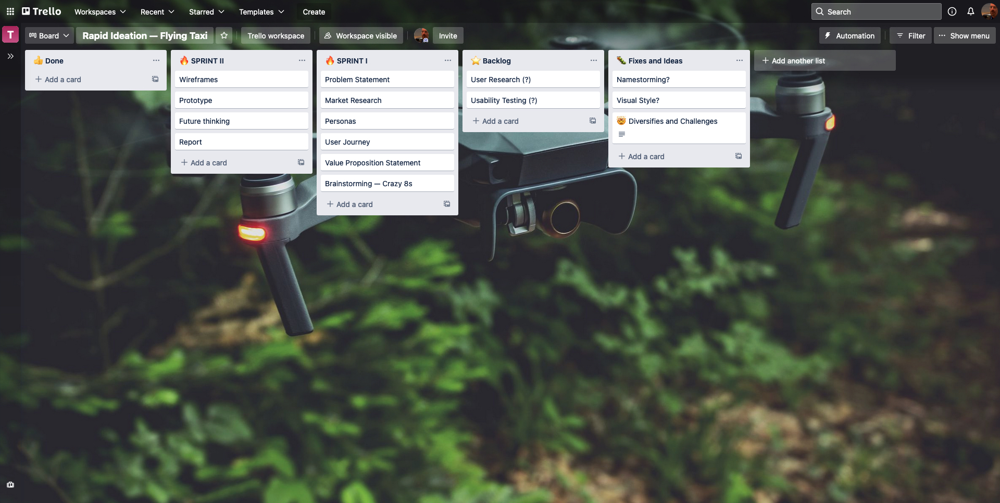
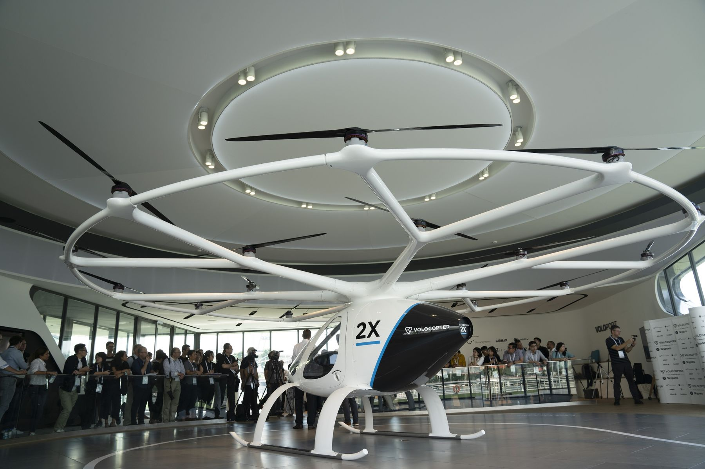
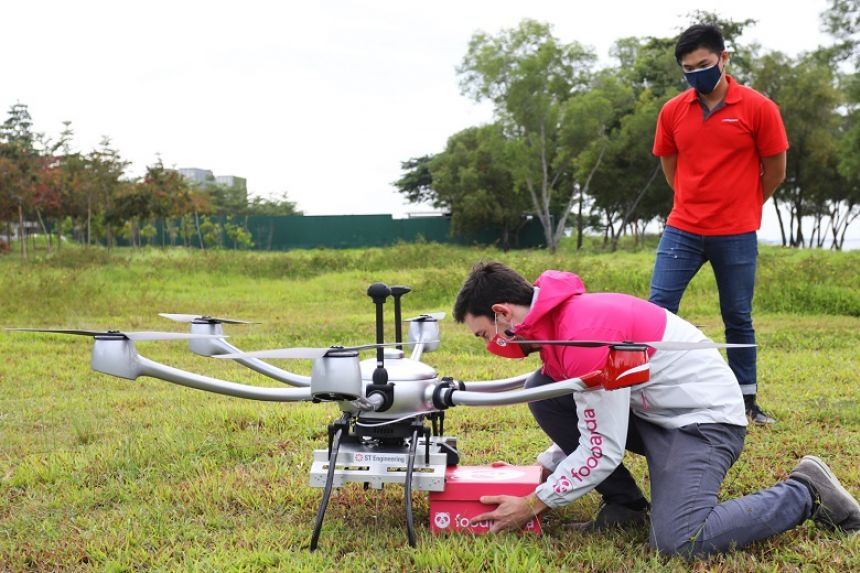
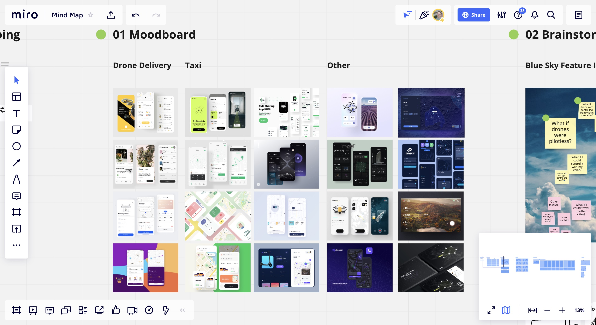
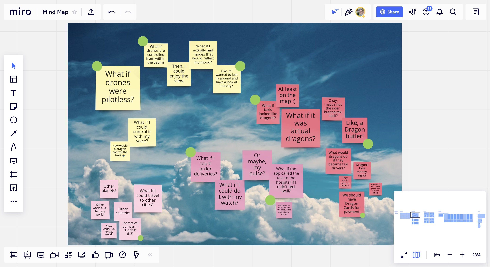
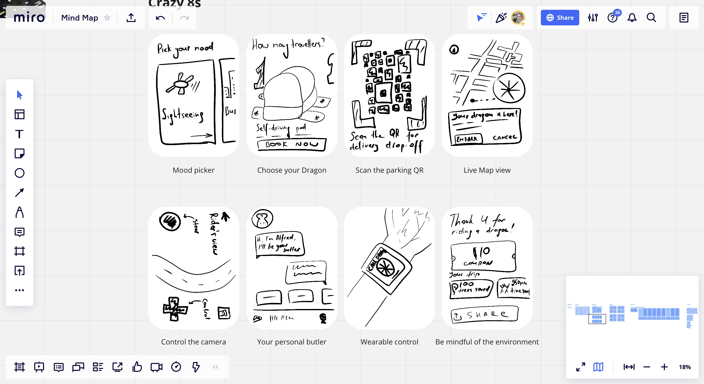
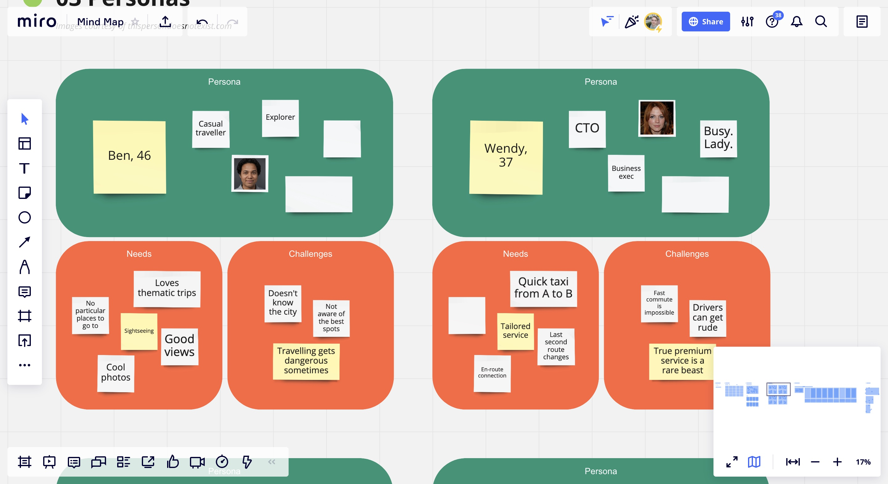
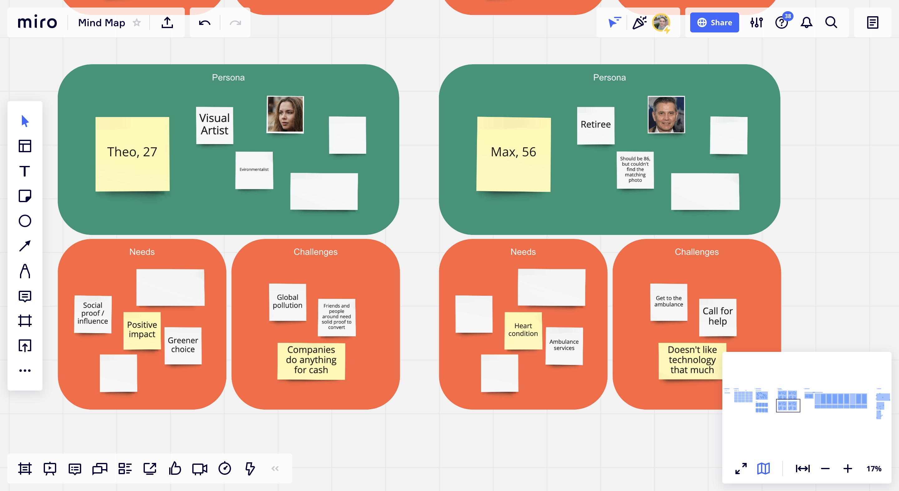
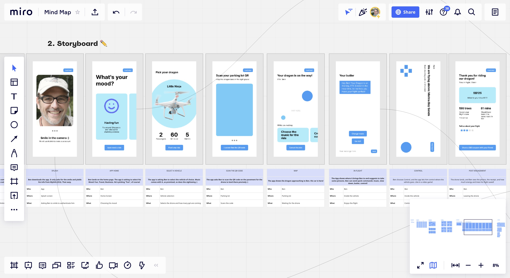

## Coming up with the idea

I decided to spend some time brainstorming the idea: although the first look at the image already gave me the initial direction, I needed to refine it further. I used Miro board for the ideation session, and continued using it throughout the entire duration of the sprint for ideation and flow design.

I used mind–mapping technique to explore the topics of the image first. I set the limit to 5 minutes, and during the mind storming, I came up with a set of keywords (and phrases) I would use to produce the concept. Some of the ideas that came into my mind:

-   The dragon doesn’t look hostile. They are smiling and waving, as if greeting the child;
-   The child may have wielded the sword to draw dragon’s attention, not to fight;
-   Given that, the dragon might be there to take the child some place else.

I researched the news and came across an interview with Stephen Fitzpatrick, founder and CEO of Britain’s Vertical Aerospace, who believes that flying taxies might finally “take off” in mid-2020s. That settled the topic: the application for hailing flying taxis which is set to revolutionise travel, provide a greener alternative for traditional transportation, attract new tourists and visitors, allow for faster and hassle–free transportation. 

I used a Trello board to track progress and allocate tasks to myself. I also decided to use Framer — a tool I have never used before — for visual design and prototyping, as part of fulfilling my previously set [[2021-10-18 Analysing the Journal|SMART goals]].

Overall, the beginning promised an exciting and challenging adventure.

---

## Understanding the market

What is a flying taxi, anyway?

Well, Singapore is [set to have one by 2023](https://www.bloomberg.com/news/articles/2020-12-09/first-electric-air-taxis-set-to-fly-in-singapore-by-2023) (Weiss 2020), with Volocopter already selling tickets for initial services, at around $300 for a short 15 min trip around Marina Bay.

*Photo: The Volocopter 2X. Photographer: Wei Leng Tay/Bloomberg *

The flying taxi market is enormous, that's no exaggeration. A device that cruises at 180 mph at altitudes of around 1,000 ft is (apparently) being actively tested by multiple companies. Toyota, Uber, Hyundai, Airbus, and Boeing are [fighting to be the first to get it](https://www.cnbc.com/2020/03/06/the-flying-taxi-market-is-ready-to-change-worldwide-travel.html) (Hornyak 2020) into the market that may be worth $1.5 trillion by 2040.

At this point, the flying taxis promise a transportational revolution:
- A green alternative to traditional transportation: 52 percent fewer emissions per trip than the gas car (at least as long as we [use them right](https://www.popsci.com/emissions-flying-taxis/) (Chrobak 2019) — for long–distance travel, for instance);
- A fast, convenient, robust mean of transportation;
- A great tourist attractor;
- And many more.

Some, however, are not impressed by the progress the giants managed to demonstrate thus far: flying taxis are seen as [helicopter for the rich](https://www.theverge.com/2019/11/21/20974817/volocopter-flying-taxi-station-voloport-singapore-test-flight) (Ong 2019), elitist and underwhelming. At least for now.

Flying taxis are still more of a "work in progress" rather than a real deal, but the drones market that emerged recently, has made it possible for such an invention to go public at a relatively low cost. [Drone delivery market](https://www.mordorintelligence.com/industry-reports/delivery-drones-market), for instance, is on the rise, and it seems to be only a matter of time before flying cars can carry not only a parcel, but a passenger or two.

How does that inform the project? There are some **insights** here that I may have overlooked, had I jumped into implementation phase right away:

- The "flying cars" are likely to remain an expensive experience for a while;
- Typical use cases are likely to involve tourists, business users, and special occasions (i.e. anniversary), due to high costs and limited fleet and parking availability — especially in the small city with a dense population;
- Flying cars are relatively similar to drones, so looking at how drones delivery apps look, feel, and work might be a good inspiration.

*Image: my moodboard after conducting some research*

**How might we** design a product that will help match the needs of the consumer of said categories (potentially expanding it towards the general population) with the value proposition of a flying vehicle?

---

## Brainstorming the idea

I decided to take a step back and take a bird's eye view of the project: what shall it be? At this point, I didn't quite know where to begin, as I was having too many fleeting thoughts, so I decided to again employ the method I had never used before — the Blue Sky Thinking technique. 

Letting the mind roam freely, surprisingly, helped form the idea. I marked some of the features I found to be precisely what needed to be implemented (some of them made it into the final product):

- **Pilotless drones** with an Artifical Intelligent to walk the user through their journey;
- **Customised travel routes**, including "routes to nowhere" to attract tourists and use the taxis for special occasions;
- **Thematic routes** — taxis taking the customer to a notorious landscape (i.e. fans of "The Lord of the Rings" could visit the Hobbiton in New Zealand);
- Built–in **delivery** functionality, combining drones and flying taxis;
- A smart **wallet** — to pay for the rides and, potentially, grow the money within the app's ecosystem;

I have also included a feature for the smart watch that would call an **ambulance drone**, similar to how Apple Watch use [fall detection](https://support.apple.com/en-sg/HT208944) and call the ambulance. 

I am not great at drawing things, so naturally, I proceeded with using the Crazy 8s technique to help me visualise some of the core features.

---

## Who am I designing for?

In order to understand what the potential customers may require, I put together a set or primary personas, and later use of their journeys for the rapid ideation.

The first two personas — **Ben, Casual Traveller** and **Wendy, CTO** — essentially shaped the core proposition of the application.

> Provide comfortable service, foresee and address the needs of each customer, tailor and personali the experience.

The second set of personas — **Theo** and **Max** — helped understand how the value proposition of the flying taxis as an eco–friendly alternative to traditional transportation and a socially important service could be utilised in the application.

Overall, the primary customer base of the initial product was likely to be limited to occasional tourists and business users, with a potential for a rapid expansion, so the application had to provide a powerful set of tools and features:

- **Customised experience**: from A/C settings to music;
- **Personality**: machines that feel human, not play human;
- **Clear benefits for the environment**, presented in a customer–friendly fashion.

I decided to use the Wireflows canvas to walk **Ben** through his experience, identify the key interactions and touchpoints, and define the flow for the high fidelity prototype. Wireflow turned out to be exactly what it was meant to be — a great combination of wireframes and storyboard, describing both the visuals and the interaction (Laubheimer 2016).

Ben would go through four phases throughout his short but unforgettable journey with the app:

1. **Acquisition** and **Activation**: he would search for the taxi app and onboard it with nothing but a smile — smooth and fun experience;
2. **Pre-flight**: the app will ask Ben what he feels like doing, suggests the optimal vehicle, and prepare a soundtrack for the ride;
3. **Mid–flight**: Ben will be in control of his experience, navigating the drone and taking great pictures;
4. **Referral**: we will not forget to thank Ben and his friends with a discount coupon, and remind him of the impact other means of transportation leave on the climate.

This way, Ben's journey will not only be exciting, but extremely meaningful, memorable, and mesmerising.

---

## Prototype

As mentioned before, I used Framer for prototyping: it turned out to be a powerful, yet somewhat raw tool that was capable of many great things — from built-in webcam functionality to embedded Spotify playlists. 

Below is the video walkthrough of the prototype: from onboarding the user to turning them into a loyal advocate.

Please welcome, **Dragon Fly**.

<iframe src="https://player.vimeo.com/video/638896449?h=4ae28e1461&amp;badge=0&amp;autopause=0&amp;player_id=0&amp;app_id=58479" frameborder="0" allow="autoplay; fullscreen; picture-in-picture" allowfullscreen style="position:absolute;top:0;left:0;width:100%;height:100%;" title="Dragon Fly.mp4"></iframe>

---

## Assets

If you want to learn more or test the prototype, feel free to use the following links:

- [Download the PDF](./img/05-DragonflyKeynote.pdf) of the product's presentation;
- [Access the prototype in Framer](https://bit.ly/3Gmwf5O).

---

#### References

WEISS, R. 2020. ‘Singapore Set to Have Flying Electric Taxi Service by 2023’. Bloomberg.com, 9 Dec [online]. Available at: https://www.bloomberg.com/news/articles/2020-12-09/first-electric-air-taxis-set-to-fly-in-singapore-by-2023 [accessed 28 Oct 2021].

HORNYAK, Tim. 2020. ‘The Flying Taxi Market May Be Ready for Takeoff, Changing the Travel Experience Forever’. CNBC [online]. Available at: https://www.cnbc.com/2020/03/06/the-flying-taxi-market-is-ready-to-change-worldwide-travel.html [accessed 28 Oct 2021].

‘Are Flying Cars Preparing for Takeoff?’ 2021. Morgan Stanley [online]. Available at: https://www.morganstanley.com/ideas/autonomous-aircraft [accessed 28 Oct 2021].

CHOROBAK. 2019. ‘Flying Cars Will Only Be Eco-Friendly If We Use Them Right’. Popular Science [online]. Available at: https://www.popsci.com/emissions-flying-taxis/ [accessed 28 Oct 2021].

ONG, Alexis. 2019. ‘The Flying Taxi Future Is Coming, but It’s Elitist and Underwhelming’. The Verge [online]. Available at: https://www.theverge.com/2019/11/21/20974817/volocopter-flying-taxi-station-voloport-singapore-test-flight [accessed 28 Oct 2021].

LAUBHEIMER, P. (2016) ‘Wireflows: A UX Deliverable for Workflows and Apps’ [online], Nielsen Norman Group, 4 December. Available at: https://www.nngroup.com/articles/wireflows/ [accessed 27 August 2020]