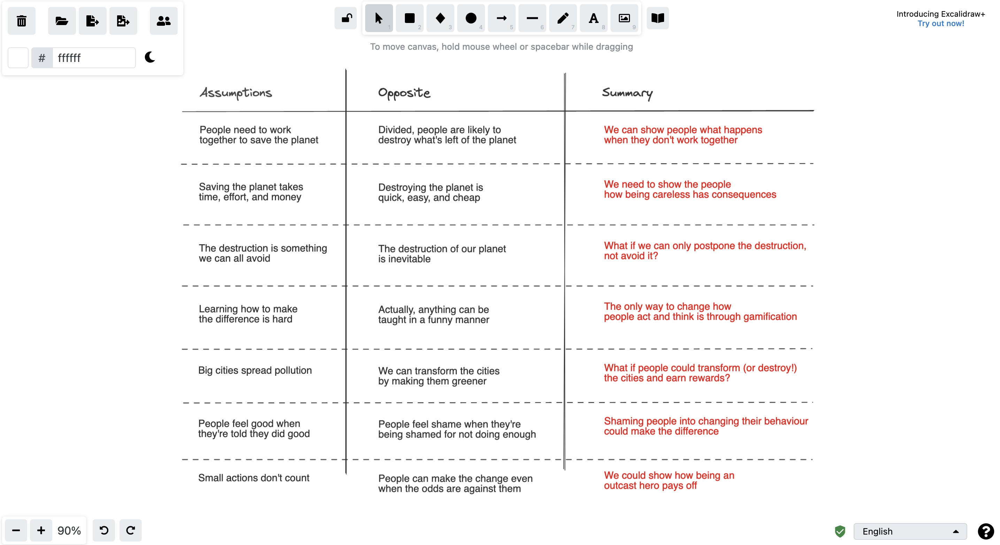
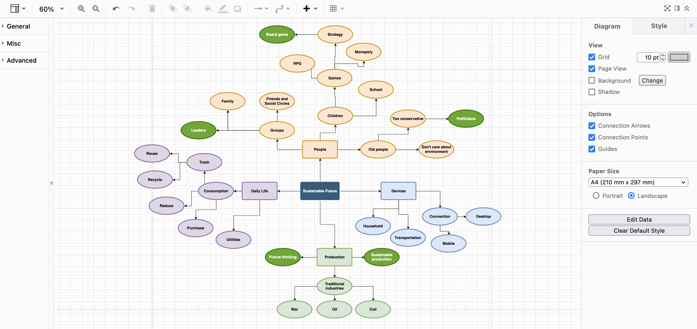

> This entry is being actively updated

## Version Control

Following this week's assignment, I set up a [GitHub Repository](https://github.com/sirkotsky/GDO710-RI), although there seems to be very little potential of using Git for any design outputs, unless I will be willing to use GitLab's [design management](https://docs.gitlab.com/ee/user/project/issues/design_management.html). It is promised to provide exceptional functionality for storing wireframes and other design outputs (GitLab 2021), so I shall give it a try in the future. 

I was happy to fulfil the promise given on [[2021-10-18 Analysing the Journal|Week 5]]: I started communicating with my peers, on the Forum and in Discord alike. Just last week we discussed the importance of version control for designers and the difference between that of Figma and git.

## Rapid Ideation Week II — Kick Off

For this sprint's ideation, I chose the first topic — environment and sustainability. I also decided to challenge myself, fulfilling my SMART goal, and only use open–source software for ideation and delivery. 

### Tools

Despite some complications, I managed to discover alternatives for the majority of popular design tools:

- [Penpot](https://penpot.app/) instead of Figma for design and prototyping;
- [Kanboard](https://kanboard.org/) instead of Trello for planning;
- [Excalidraw](https://excalidraw.com/) instead of Miro for whiteboarding activities;
- [Diagrams](https://app.diagrams.net) for mind mapping.

### Ideation

I started by reversing the topic and exploring it using the Opposite Thinking framework (Board of Innovation). What do people think about climate change and the impact their actions have on the environment? What's the role of the corporations? Do small actions count?

By the time I finished the exercise, I gained some understanding of what my artifact could help achieve:

- It would help people understand that small actions count;
- It would demonstrate the consequences of recklessness;
- It would use gamification to educate people — the simpler the mechanics, the better.

I put together a Mind Map to explore how I can execute the plan: what would be the topics I could cover? which directions I could take?

I discovered some of the topics I found rather fascinating:

- People follow the leaders, and rely on politicians: my artifact should incorporate their presence;
- Environment is polluted by production, especially the traditional industries (which also seem to be profitable);
- In terms of gamification, mobile and board games seem to be a big hit — however, since I decided to challenge myself to do something new every time, board game would be precisely that.

At this point, I have outlined the key topics, and my artifact's core idea looked as follows:

- It would be a board game that features a main character (the small human) opposing the corrupt politicians and corporations, who are equally eager to destroy the world for profit;
- The main character would be tempted to take simple actions for immediate profit — sustainable decisions will not pay off for a long time;
- The character will progress and face tougher decisions — from managing a small office to running the country;
- The game will use simple mechanics to show how simple actions can make great change — much like "Papers, Please" or "Monopoly", with the complications growing as the player progresses.

---

#### References

‘Design Management | GitLab’. 2021. [online]. Available at: https://docs.gitlab.com/ee/user/project/issues/design_management.html [accessed 5 Nov 2021].

Board of Innovation. ‘Opposite Thinking’. Available at: https://www.boardofinnovation.com/tools/opposite-thinking [accessed 22/12/2020].