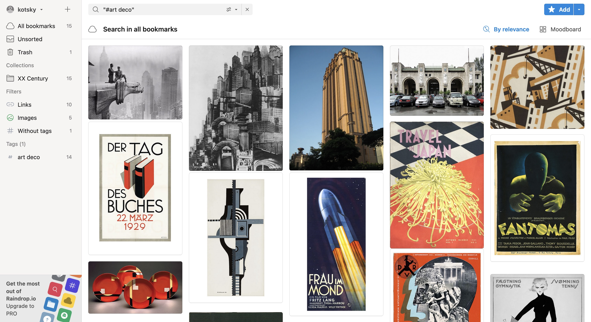
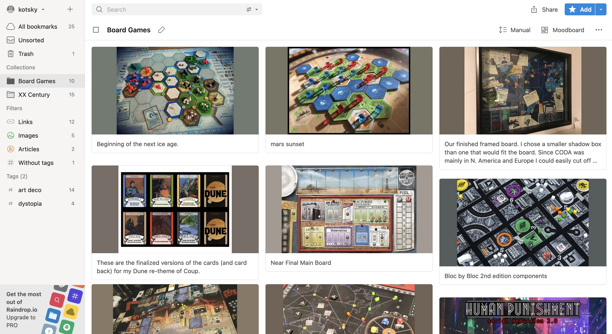
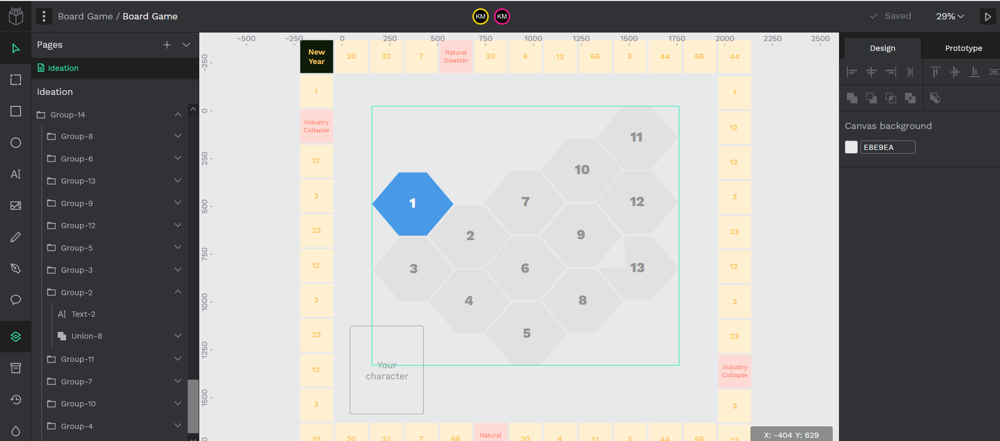

## Version Control

Following this week's assignment, I set up a [GitHub Repository](https://github.com/sirkotsky/GDO710-RI), although there seems to be very little potential of using Git for any design outputs, unless I will be willing to use GitLab's [design management](https://docs.gitlab.com/ee/user/project/issues/design_management.html). It is promised to provide exceptional functionality for storing wireframes and other design outputs (GitLab 2021), so I shall give it a try in the future. 

I was happy to fulfil the promise given on [[2021-10-18 Analysing the Journal|Week 5]]: I started communicating with my peers, on the Forum and in Discord alike. Just last week we discussed the importance of version control for designers and the difference between that of Figma and git.

## Rapid Ideation Week II — Kick Off

For this sprint's ideation, I chose the first topic — environment and sustainability. I also decided to challenge myself, fulfilling my SMART goal, and only use open–source software for ideation and delivery. 

### Tools

Despite some complications, I managed to discover alternatives for the majority of popular design tools:

- [Penpot](https://penpot.app/) instead of Figma for design and prototyping;
- [Kanboard](https://kanboard.org/) instead of Trello for planning;
- [Excalidraw](https://excalidraw.com/) instead of Miro for whiteboarding activities;
- [Diagrams](https://app.diagrams.net) for mind mapping;
- [Raindrop](raindrop.io) instead of Pinterest for collections and moodboards;
- [LibreOffice](https://www.libreoffice.org) to build game mechanics.

### Ideation

I started by reversing the topic and exploring it using the Opposite Thinking framework (Board of Innovation). What do people think about climate change and the impact their actions have on the environment? What's the role of the corporations? Do small actions count?

By the time I finished the exercise, I gained some understanding of what my artifact could help achieve:

- It would help people understand that small actions count;
- It would demonstrate the consequences of recklessness;
- It would use gamification to educate people — the simpler the mechanics, the better.

I put together a Mind Map to explore how I can execute the plan: what would be the topics I could cover? which directions I could take?

I discovered some of the topics I found rather fascinating:

- People follow the leaders, and rely on politicians: my artifact should incorporate their presence;
- Environment is polluted by production, especially the traditional industries (which also seem to be profitable);
- In terms of gamification, mobile and board games seem to be a big hit — however, since I decided to challenge myself to do something new every time, board game would be precisely that.

At this point, I have outlined the key topics, and my artifact's core idea looked as follows:

- It would be a board game that features a main character (the small human) opposing the corrupt politicians and corporations, who are equally eager to destroy the world for profit;
- The main character would be tempted to take simple actions for immediate profit — sustainable decisions will not pay off for a long time;
- The character will progress and face tougher decisions — from managing a small office to running the country;
- The game will use simple mechanics to show how simple actions can make great change — much like "Papers, Please" or "Monopoly", with the complications growing as the player progresses.

## Research and moodboards

In short forum discussion, Lauran mentioned Fritz Lang's classics "Metropolis" as a great example of the appropriate setting for the game, being a story of the technological society expanding at the expense of the forests and natural areas (Lang 1927). Once again, great reminder of how SMART goals, especially those in the interpersonal domain, help not only establish connection, but also learn of new things and find creative directions.

It inspired me to look into German Expressionism and the classical dystopias for the inspiration, as well as to start collecting artworks in the Art Deco style — the style that stems from the "desire to move into the new century in step with innovation", whose very aesthetic "emphasized machine-age streamlining and sleek geometry" (The Art Story 2021). 

I also decided to look into dystopian board games to better understand the mechanics, as well to gather enough material to remediate into my prototype. 

As I was exploring the unfamiliar world of dystopian board games, I made a few notes to help me establish a firm foundations for the game:

- The game should be non–linear and feature "free will" — the player should decide whether they want to destroy or save the planet;
- It should offer a creal objective for the chosen path;
- It should feature various characters, situations, and complications to make the journey personal and exciting;
- Co–op game is a great way of teaching the importance of collaboration and working together towards achieving a big goal.

### Early Discovery

I started mapping out the game mechanics using the open-source technology — a piece of paper, a pen, and the Penpot app. I decided on a simple mechanics that would later make it into the final board game.

- *The characters*: the player will start with picking their character from the stack. The card will define the characteristics of their avatar;
- *The map*: the board will feature a set of hexagonal spaces comprising the Planet. The game will begin with one hexagon at the player's disposal, as the game progresses, the player occupies more space and chooses how to develop it  — whether to expand their city, or to preserve the nature;
- *The parameters* — the player will have to manage their city's Health, Wealth, Temperature, and Happiness in balance;
- *The project cards* — the player will be responsible for the implementation of the city development projects. It will be the player's choice whether to invest in the industry, or to choose more sustainable sources and preserve the nature. The industry will bring more profit, but would diminish the health and increase the temperature. Sustainable projects would demand more investment, and won't pay off for a long time. The key challenge of the game would be to preserve the balance and the harmony;
- *The danger cards* — occasionally, the player would have to face the dangers of the world — a natural disaster, for instance. Big corporations may threaten their wellbeing. Eco-activists will boycott their factories. 

The goal of the game would be to expand the city limits while sustaining a good balance between green and traditional economy. The game can be played in groups — if more than one person is playing the game, their goal would be to develop a more prosperous, well-balanced city.

---

#### References

‘Design Management | GitLab’. 2021. [online]. Available at: https://docs.gitlab.com/ee/user/project/issues/design_management.html [accessed 5 Nov 2021].

Board of Innovation. ‘Opposite Thinking’. Available at: https://www.boardofinnovation.com/tools/opposite-thinking [accessed 22/12/2020].

LANG, Fritz, Brigitte HELM, Alfred ABEL and Gustav FRÖHLICH. 1927. Metropolis [Film]. Universum Film (UFA).

‘Art Deco - Concepts & Styles’. 2021. The Art Story [online]. Available at: https://www.theartstory.org/movement/art-deco/history-and-concepts/ [accessed 6 Nov 2021].