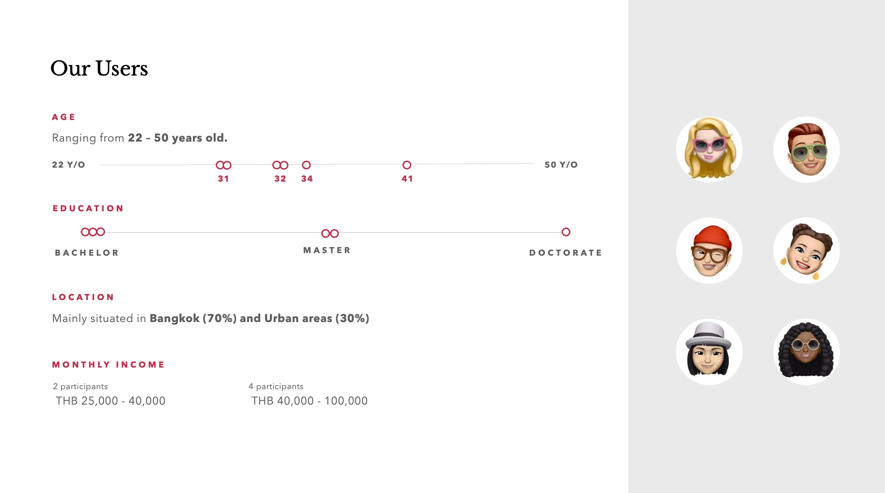

> This entry is being actively updated

While working on the rapid ideation project, I began studying the importance of ethics in research and the various methods that are applied by myself, my teams, and other practitioners I work and collaborate with.

As a practising UX designer, I've mostly been restricting myself to using non–invasive and quick methods of testing and validation — moderated interviews, questionnaires, Treejack, diary studies. I still follow Jacob Nielsen's (1997) advice  and only use focus groups to uncover what the customers want, not to assess interactions. 

I never got the opportunity to use complex equipment to test emotional perception or evaluate usability with high precisions, using ECG or and eye tracker.

### Validating the RI Project

For the current rapid ideation session, I am somewhat restricted by the consequences and the planned outputs:

- Due to the pandemic, I am not allowed to interact in a group of more than 2 people, myself included, so I will not be able to conduct in–person sessions;
- My board game was initially set to be a physical artefact, so testing it remotely will not be possible;
- I would either have to "digitalize" the product, or find a way of gathering qualitative data from the testing.

While in–person interviews and focus groups don't seem to be feasible, I am tempted to use **Diary Study** as a mean of testing the product. 

I would produce 3 copies of the board game and ask my friends from different walks of life (a fresh graduate, a young father, an experienced exec) to try it out and record their thoughts and feelings throughout the experiment. 

Diary study, however, is likely to require an extremely high fidelity of the product, and will take a few weeks to complete (Salazar 2016). As an alternative method, I could revert to a **Cognitive Walkthrough** which promises a less invasive and time–consuming testing process, but still yields great results and provides insights on usability (The Interaction Design Foundation).

### Ethics and research

Researching the Facebook's highly unethical “violation of the rights of research subjects” (Caplan, Seife 2014) made me think about my own practice and the way I communicate with the subjects of my research — whether in–person or online.

I always start by making sure the participant is aware of the context of the study, the goals, and the requirements. I set the timeframe and make sure to include the passage about the data privacy — how the information they are about to share will not be openly available to anyone outside the design team, especially if the recording (with the subject's permission) takes place. Here, however, I have to point myself to the fact that often during the interviews, I make sure the participant is aware that the session is being recorder, but don't ask for explicit consent — I should make sure to include asking for a permission: "Are you comfortable with the session being recorded?" vs "For your information, the session is being recorded". 

Watching the video by Alcwyn Parker made me recall the studies I had previously conducted, alone or with the team. For one of the report, we concealed the identities of the participants and used emojis to represent their personas: this way, the report could circulate openly without the fear of any participant's private information being revealed.

---

#### References

NIELSEN, Jacob. 1997. ‘Focus Groups in UX Research: Article by Jakob Nielsen’. _Nielsen Norman Group_ [online]. Available at: [https://www.nngroup.com/articles/focus-groups/](https://www.nngroup.com/articles/focus-groups/) [accessed 9 Nov 2021].

SALAZAR, Kim. 2016. ‘Diary Studies: Understanding Long-Term User Behavior and Experiences’. _Nielsen Norman Group_ [online]. Available at: [https://www.nngroup.com/articles/diary-studies/](https://www.nngroup.com/articles/diary-studies/) [accessed 9 Nov 2021].

‘How to Conduct a Cognitive Walkthrough’. 2021. _The Interaction Design Foundation_ [online]. Available at: [https://www.interaction-design.org/literature/article/how-to-conduct-a-cognitive-walkthrough](https://www.interaction-design.org/literature/article/how-to-conduct-a-cognitive-walkthrough) [accessed 9 Nov 2021].

CAPLAN, A, SEIFE, C. 2014. ‘Facebook experiment used Silicon Valley trickery‘. _NBC News_. Available at: [http://www.nbcnews.com/health/mental-health/opinion-facebook-experiment-used-silicon-valley-trickery-n144386](http://www.nbcnews.com/health/mental-health/opinion-facebook-experiment-used-silicon-valley-trickery-n144386) [accessed 11 July 2014].