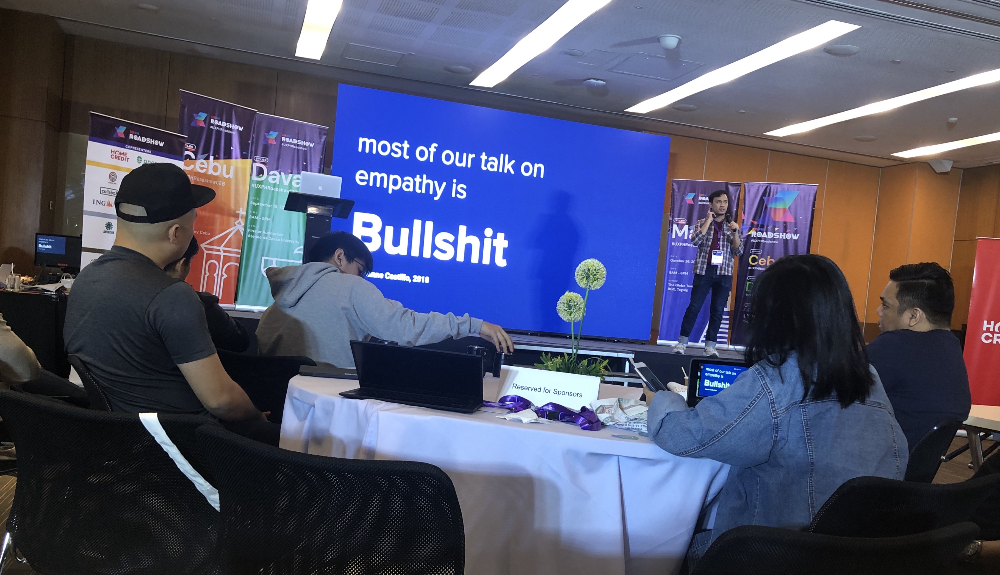
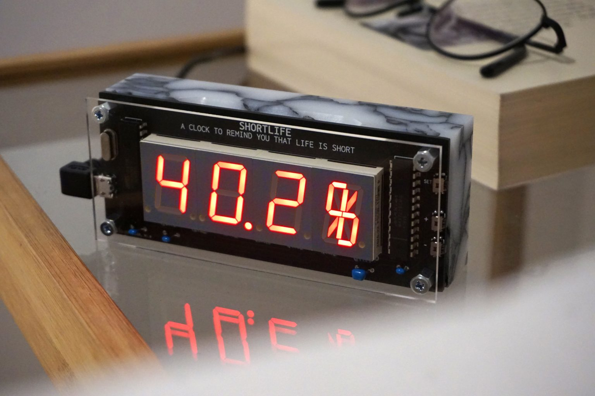
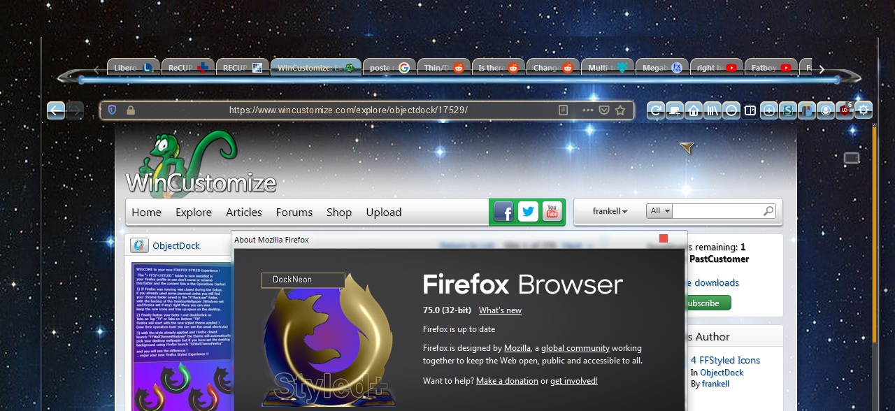

## Personal Experience

I have rarely been active in the design communities (ever), despite possessing some experience in the field and working on many exciting projects across all ASEAN region and beyond. 

In October 2019, I participated in my latest to date real–life design conference — [UX PH Roadshow in Manila](https://www.uxph.org/blog/recap-manila-2019/), where global and local design leaders shared their experience, gave talks about culture, empathy, research.

The most memorable part of all was Matthew Green's (Asian Development Bank) workshop on facilitating research and working with data. I absolutely loved Matt's introduction (physical warm-ups used to be fun), and the practical part was extremely insightful and entertaining.

Just a few months back I myself participated in a talk on switching into UX design, hosted by [Friends of Figma](https://friends.figma.com/), which was incredibly fun. 

<iframe width="100%" height="400" src="https://www.youtube.com/embed/mC8YVcJM8uA" title="YouTube video player" frameborder="0" allow="accelerometer; autoplay; clipboard-write; encrypted-media; gyroscope; picture-in-picture" allowfullscreen></iframe>

Meeting people whose story is somewhat similar to yours, and getting a chance to inspire those looking to change their lives and pursue the dream of becoming a designer, is incredibly empowering. 

At the same time, I've always experienced anxiety when approaching the communities: either because of the impostor syndrome, or because I didn't have an interesting story to share or a project to showcase, I still feel like I have very little to offer to the community. 

In a way, researching the importance of communities brings me back to [[2021-10-18 Analysing the Journal|Week 5]] and setting the SMART goals. I should add ‘be active in the community of your choice‘ to the list, more specifically — to join their daily and weekly discussions, leave at least 5 comments each week in their Discord chats, and participate in the webinars they host every month. This way, I can make more friends and connections, learn something new, and discover whether my story is truly worth sharing.

---

## Researching the communities

### Local Communities

Singapore is a rather tiny country, and the choice of the local design communities to join is a tad limited. I already spoke about my involvement with Friends of Figma, I would love to get more active in their channels. 

### Finding a Role Model

Outside the many people I work closely with, if I were to find one designer whose craft I admire, I would name [Dries Depoorter](https://driesdepoorter.be) — an artist and a craftsman who works on weird products.

Working on [Inspickle](https://inspickle.herokuapp.com/) — a fake grocery planning app that would automatically replace unhealthy items with healthy analogues, I drew inspiration from Dries's [Shortlife](https://driesdepoorter.be/shortlife/) and other projects.

Dries's exception fantasy and creativity are paired with his impeccable craft and skill. He delivers outstanding products of great quality, and his personal style is simply remarkable.

### Open-Source Community

As I wrote previously, I am very much open to using FOSS. I once wrote [an article](https://www.linkedin.com/pulse/designer-friendly-open-source-christian-michel/) about designers using and contributing to the development of the open-source software. 

In my article, I wrote about why open-source community didn't welcome designers until recently, but luckily, things are changing. I myself would love to contribute to the development of a few open-source products I'm using on a daily basis — **Firefox** (although the opportunities that are open to designers with them are rather [limited](https://firefox-source-docs.mozilla.org/contributing/contributing_to_mozilla.html)), **Thunderbird** (I already started working on a redesign project, but the community doesn't seem to [appreciate the changes](https://www.monterail.com/blog/2016/the-power-of-email-clients-why-did-we-redesign-thunderbird)), and a few others. 

--- 

## Ethnography Report

> This section is in the making :)