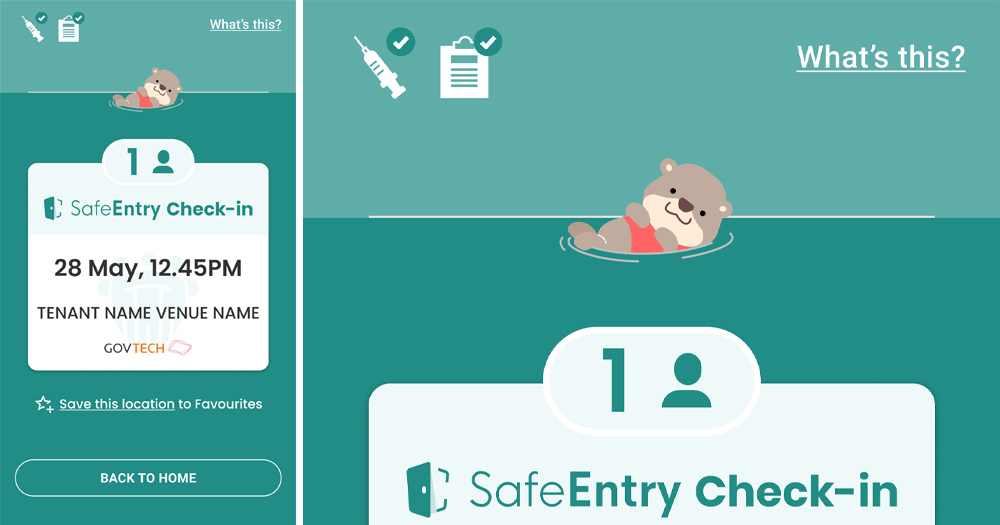
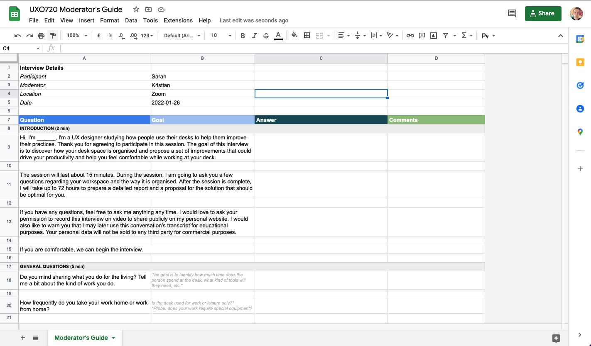
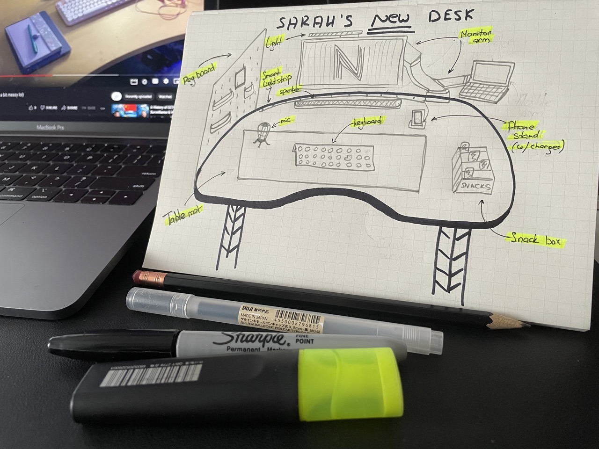
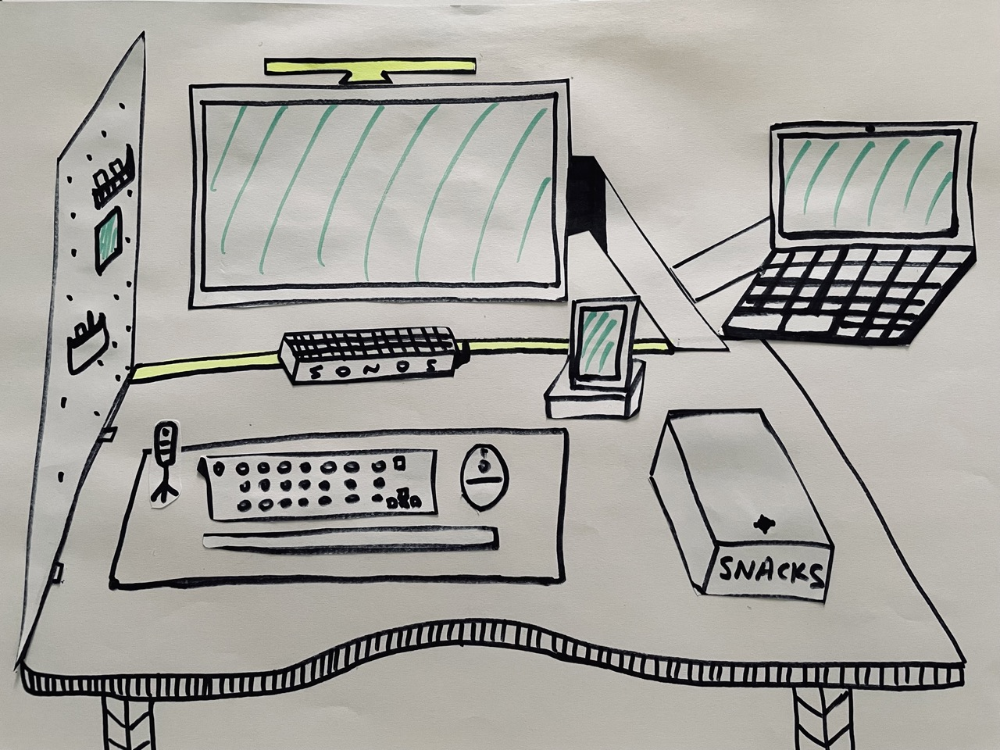

## Challenging the definitions: UX Design and Design Thinking

### Understanding UX

This week, we were asked to share our definition of UX, reflecting on the recent product experience. I brought up the example of TraceTogether — a contact tracing system that is implemented in Singapore. 

Visitors are required to scan a QR code or check in with a token upon entering a shopping mall, a store, any non-residential place. Security guards at the gates are deployed to check the vaccination status: some 6 months ago, they would have to watch closely for a small green rectangle in the right-hand corner, which took them a while and often delayed entry for many people.

Govtech designers found a brilliant and simple solution: now, as you scan a QR code, it shows a green screen (for fully vaccinated individuals), which clearly indicates the vaccination status. To prevent people from showing static screenshots, they have implemented an animated otter that floats at the top — this way, a quick glance at a screen is enough to skim through all details and make a decision to let the person in. 

User experience design is about understanding the pains the users are having, their expectations and aspiration, it is about discovering feasible, desirable, and viable ways of solving them. Good customer experience is a powerful loyalty driver, and badly though through product causes nothing but irritation and disappointment.

As Ben Ralph puts it broadly, ‘UX Design is studying user behaviour and understanding user motivations with the goal of designing better digital experiences’ (Ralph 2020). I agree with the notion that understanding lies at the foundation of the user experience design.

As a UX practitioner, I often look back at the five foundational competencies of user experience design: Information Architecture, Interaction Design, Usability Engineering, Visual Design, Prototype Engineering (Psomas 2007), reflecting on which ones I lack the most. 

I would love to develop a better in-depth understanding of Usability Engineering — as someone who has been working with rapid ideation, prototyping, and quick delivery a lot, I never get enough chance to facilitate validation sessions or participate in usability testing. In the coming months, I would like to spend less time brainstorming solutions and creative concepts and focus on testing assumptions, validating solutions, and getting insights from the real users.  

Another area I would personally love to build more competence in is visual design, specifically motion design, which I never got to practice as much as I would prefer to. I would love to use this opportunity to explore how motion design works and how it can be used to help create more immersive prototypes and user experiences.

### What is Design Thinking?

Tim Brown, Executive Chair of IDEO, gives a simple definition: it is ‘a human-centered approach to innovation that draws from the designer’s toolkit to integrate the needs of people, the possibilities of technology, and the requirements for business success’ (Brown). 

Michael Lewrick, the author of ‘The Design Thinking Playbook’ goes a bit further, diving deep into how Design Thinking is used in order to uncover the deepest and most unexpected needs of customers, how solutions are derived, tested, and delivered (Lewrick 2018). They both, however, have a simple idea in common: Design Thinking is a loose guide that helps avoid jumping straight to the conclusion and instead take some time to think. 

To me, however, it is always important to remember that Design Thinking poses a threat of overexcitement: as Michael Roberto puts it in ‘Unlocking Creativity’, it tends to wear out rather quickly (Roberto 2019).

> Design thinking all too often delivers a wonderful day or two off from the realities of boring old business-as-usual... In reality, when you return from a trip to Brainstorm Island you probably won’t have done any real innovation— at least, not the sort that’s going to transform the fortunes of your business.

I can trace my personal progress: from believing that Design Thinking was for designers only at the early years of my career, to willing to apply DT to literally anything in this world after a couple years in the UX field, to finally accepting that Design Thinking provides a fun and meaningful framework, but it is only useful when it can be applied to practice. 

Before jumping into brainstorming the possible solution, it is important to understand the user: their needs, goals, and expectations. I applied this thinking into preparing to complete this week's challenge activity.

---

## Learning in practice: weekly redesign challenge

### Empathise 

For this creative activity, I was tasked to pair up with [Sarah Novianti](https://obsidian-barberry-774.notion.site/Sarah-S-Novianti-0552274a1dca45ef9150df7a234093e5) on the journey of redesigning each other's desk spaces. I decided to use this opportunity to practice facilitating semi-structured interviews.

I prepared a moderator's guide, following the recommendations outlined by Chauncey Wilson in ‘Interview Techniques for UX Practitioners: A User-Centered Design Method’: short and clear, well-structured, only featuring questions relevant to the topic of research (Wilson 2013). 

I kept the questions short and well-organised, made sure to add a ‘goal’ column to ensure I extract the most relevant information and probe for other potential discoveries. I included a request for an explicit consent to record an interview, a practice that researchers claim to be an essential part of all research endeavours (Byrne 2001).

When working on the challenge, I applied design thinking and followed the Double Diamond module through the phases of Discovery, Definition, Design, and Delivery (Drew 2018).

### Facing difficulties

Although it is highly recommended to facilitate interviews in person, or at the very least over the phone to ensure the quality of the outputs (Hanna 2012), my partner and I were unable to connect virtually because of the time difference between Singapore and London of 8 hours. 

We pivoted to sharing the video recordings of ourselves answering each other's questions: this way we could ensure no non-verbal cues stay unnoticed, and we have deeper quality insights than those gained over other async channels (such as Google Forms).

### Define

After watching Sarah's video and reading her notes, I summarised the problem area and reframed each problem into an opportunity:

- Her desk is used for various activities (reading, doing homework, watching Netflix), but she's only got one small Mac to work on (and another one parked behind her Mac). How might I help her organise her working space to make sure she completes her tasks and switches between activities? (bonus point — switches between devices seamlessly?)

- Her desk is rather huge, but requires some organisation and order. How might I help her allocate space for her books, planning tools, notebooks? (bonus point — save her from constantly hitting a huge drawer under her desk?)

- She clearly puts efforts into creating a cosy atmosphere: how might I help her preserve the cosiness and help organise the ‘mood-creators’?

- Sarah mentioned that the desk space was rather dark. She is also using a sunset lamp to help her fall asleep. How might I help keep it well-lit, but also preserve other lighting options?

### Ideate 

I took some time to redesign Sophia's desk, making sure to preserve the atmosphere, address the pain points, and deliver the most pleasant experience for my colleague :)

I decided to collect a board of objects that will help organise Sarah's desk better:

- Monitors for reading, Netflix, and working;
- Peg board to organise the goods;
- A snack box within reach;
- Lighting options: smart light strip (for the atmosphere) and a monitor lamp (bright enough to keep the working area well-lit).

An early sketch looked something like that:

### Test

I shared my early unfinished work with Sarah, and discovered that she loved the idea a lot:

> Snack box that is very reachable by me when I’m working? Yes I love it! 🤣 Also, I never thought about getting a monitor arm. That’s clever!

She did point out that I forgot to add the mouse to the sketch, so I had to revisit my drawings and produce the final version. I decided to cut the objects and see if I could rearrange them a bit.

### Unsolved problems

There is still much to be discovered, and the sketch I prepared could be the first step in a long voyage to perfection. 

For example, the workspace of Sarah could feature a bookshelf to help her organise her reading materials. I could also consider adding a coaster with a no spill cup (to compliment the snacks). I might have to consider adding an extra arm or a stand for the second laptop, and some more light to make sure the space is well-lit.

Reading through other submissions in the forum, I realise I should have put more effort into validating the solution: for instance, use the Kano Model metrix to validate usability, or have a closing questionnaire to make sure the details of my proposed redesign are relevant and valid (i.e. UMUX score).

---

## What I've learnt this week

- Scheduling a catch up with Sarah took a while: not only because the LMS of Falmouth does not provide contact information (unless added by a student), but because how late the pairing was released. When facilitating remote testing or interviews, make sure to schedule your session in advance. 
- Get a plan B ready in case things go wrong. In my case, I created an Excel document that I was able to share with Sarah since we were not able to meet online.
- Testing the solution early is a great way of fixing your mistakes quickly.
- Design Thinking is a great framework, but it is often tempting to jump straight into brainstorming a solution. Make sure you do your due diligence and research, research, research.

---

## My goals

- ==Build strong testing skills==. I will prepare for and facilitate at least 3 in-depth interviews and 3 usability testing sessions for the prototype assignement. I will also explore other methods of validating the solution and receiving feedback.

- ==Master a new tool==. I've been using Figma and Sketch actively for the past 4 years, and have become quite proficient in both. For this module, I would like to use an opportunity to master new design and prototyping tools, ideally open source. I will set out to explore other tools available in the market and go with something I am not familiar with, especially those that can be used for testing.

- ==Bonus: master motion design==. I have never worked on motion design projects, aside from a few small assignments in the past. I will enrol in a LinkedIn learning module to study After Effects and use self-created motion graphic assets for the prototype.

---

#### References

BROWN, T. (nd) ‘Design Thinking Defined’ [online], _Ideo Design Thinking_. Available at: [https://designthinking.ideo.com/ (Links to an external site.)](https://designthinking.ideo.com/) [Accessed 4 November 2020]

BYRNE, Michelle. 2001. ‘The Concept of Informed Consent in Qualitative Research’. AORN journal 74, 401–3.

DREW, Cat. 2018. ‘The Double Diamond: 15 Years On’. _Design Council_ [online]. Available at: [https://www.designcouncil.org.uk/news-opinion/double-diamond-15-years](https://www.designcouncil.org.uk/news-opinion/double-diamond-15-years) [accessed 24 Jan 2022].

HANNA, P. (2012). Using internet technologies (such as Skype) as a research medium: a research note. Qualitative Research, 12(2), 239–242. doi:10.1177/1468794111426607  

LEWRICK, Michael, et al. _The Design Thinking Playbook : Mindful Digital Transformation of Teams, Products, Services, Businesses and Ecosystems_, John Wiley & Sons, Incorporated, 2018. _ProQuest Ebook Central_, https://ebookcentral.proquest.com/lib/falmouth-ebooks/detail.action?docID=5357893.

PSOMAS, Steve. ‘The Five Competencies of User Experience Design :: UXmatters’. 2007. [online]. Available at: https://www.uxmatters.com/mt/archives/2007/11/the-five-competencies-of-user-experience-design.php [accessed 25 Jan 2022].

RALPH, Ben. 2020. ‘An Introduction to User Experience Design’. _Beaker & Flint_ [online]. Available at: [https://medium.com/beakerandflint/an-introduction-user-experience-design-2a7f8167bf03](https://medium.com/beakerandflint/an-introduction-user-experience-design-2a7f8167bf03) [accessed 25 Jan 2022].

ROBERTO, Michael A. 2019. _Unlocking Creativity: How to Solve Any Problem and Make the Best Decisions by Shifting Creative Mindsets_. 1st edition. Hoboken, New Jersey: Wiley.

WILSON, Chauncey. 2013. Interview Techniques for UX Practitioners: A User-Centered Design Method. Newnes.

