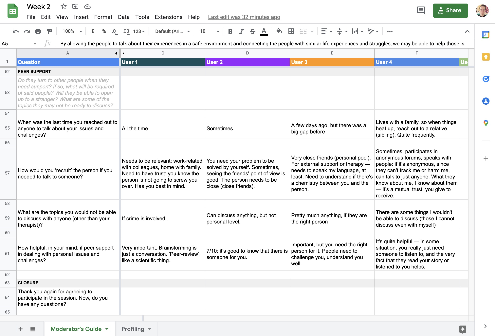
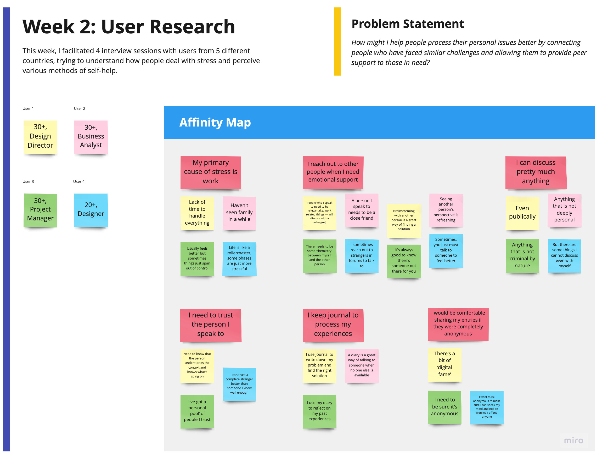

## User Research

This week was dedicated to learning about different methods of usability (not user!) testing: from task analysis to diary studies.

### New discoveries

One tool that was completely new to me was Task Analysis — I've never had a chance to use it, and it seems to be a great opportunity to practice applying it while preparing my creative assignment. Task Analysis appears to be a simple yet effective tool, although Larry Marine, for instance, warns not to confuse it with use cases (Marine 2014), which I initially thought it to be. 

Among the many things mentioned in this week's materials, I have never got a chance to work with A/B testing and customer support metrics, and although I may not be able to touch the latter, the former will surely go to my usability testing plan for the final assignment.

---

## New brief  
I chose a brief to go with, and spent this week refining the details, speaking with users I made sure to recruit early, and putting together a problem statement.

### Problem area
’Pandemic mental health’ yields almost 3 billion search results, with many researchers providing hard evidence on how the pandemic caused negative effects on the mental health of individuals (Cullen et al. 2020, Khan et al. 2020). It is obvious that the level of stress and anxiety has been increasing over the course of 2 years, and that the individuals require new methods of coping with mental issues and personal challenges, especially those who do not have access to professional help.

Technology has prepared its response to the issue, and the number of mobile apps and self-help services has tremendously increased, with proven efficacy and a promising future in the realm of helping deal with depression at an early stage (Afran et al. 2021). The majority of said apps, however, rely on self-help, either providing the user with a set of pre-designed courses (meditation, guided breathing), or interactive self-assessment tools (such as chat-bots). 

At the same time, peer support has proven to be an effective way of dealing with mental issues (Fortuna et al. 2020), and it appears to only be partially present in the digital sphere, with some apps taking off (Therapeer). What if we could help connect people with similar concerns, life challenges, and issues, making sure we leverage the modern technology, while focusing primarily on those in need of a ‘buddy’ or a ‘mentor’, as opposed to those requiring professional medical help?

### Problem statement
How might we help people process their personal issues better by connecting those who have faced similar challenges and allowing them to provide peer support to those in need?

### Hypothesis
People will feel better knowing there is someone out there willing to support them in the moment of need, free of judgement of any sort. We believe that a pathway to a prosperous society lies in creating a space where people are free to speak up, discuss their concerns, and connect with those who have had similar challenges in the past.

### User research
I started off by putting together a short moderator's guide and recruiting people guerilla-style (peers, colleagues). I tried to diversify the pool of users, and include people from different cultural background.

I focused my interviews on 4 topics:
- What are their most stress-inducing factors in life?
- What are their methods of coping with stress?
- Do they keep diaries, and whether they find them useful?
- What's their attitude towards peer support, and whether they would be comfortable discussing their issues with other people?

I summed up my findings in the affinity map below:

---

## What I've learnt this week

I initially wrote a long list of questions, covering multiple aspects of people's lives and struggles — it would take about an hour to go over all of the questions. It took me a while to rewrite the questions — and even longer to make sure to avoid leading questions, close-ended questions, as recommended by specialists (Pernice 2018).

After spending some time with the guide, I managed to narrow the questions down to a digestible amount (it took around 15 roughly to go over them with the participants). 

It took a while to convince myself that a small sample of 5 users would be enough to gain insights (Whitenton 2019), especially given the topic that was rather sensitive. However, the insights I managed to uncover — for instance, that people are rather comfortable sharing sensitive things online anonymously — provided with a great amount of powerful insights. 

I initially failed to record the first 2 interviews, and had to take notes while interviewing my users: it has proven to be extremely inconvenient and distracting, I may have missed a few insights during the interviews. I pivoted to asking for permission during the remaining interviews, and am now looking into using note-sketching (Aghanasiri et al. 2019) instead — it is supposed to provide enough flexibility and help boost my creative memory while retaining the most important insights from the participants.

## My goals
- ==Reinforce my testing skills==. By the end of next week, I will design an interview checklist to never forget to record an interview and help me structure my research process better.

- ==Explore Axure==. Well-aligned with my goal of exploring new tools, I will use this opportunity to learn Axure as a prototyping tool that provides in-depth interaction functionality.

---

#### References

AGHANASIRI, Maliheh and Grace PHANG. 2019. ‘Sketch Notes, a Non-Traditional Way for User Researchers to Take Notes’. In Aaron MARCUS and Wentao WANG (eds.). Design, User Experience, and Usability. Design Philosophy and Theory. 149–62.

AFRAN Ahmed et al. 2021. ‘A Review of Mobile Chatbot Apps for Anxiety and Depression And their Self-Care Features’. _Computer Methods and Programs in Biomedicine_ 1.

CULLEN, Walter, Gautam GULATI and Brendan KELLY. 2020. ‘Mental Health in the COVID-19 Pandemic’. _QJM : monthly journal of the Association of Physicians_ 113.

FORTUNA, Karen L. et al. 2020. ‘Digital Peer Support Mental Health Interventions for People With a Lived Experience of a Serious Mental Illness: Systematic Review’. _JMIR Mental Health_ 7(4), e16460.

KHAN, Abid Hasan et al. 2020. ‘The Impact of COVID-19 Pandemic on Mental Health & Wellbeing among Home-Quarantined Bangladeshi Students: A Cross-Sectional Pilot Study’. _Journal of Affective Disorders_ 277, 121–8.

MARINE, Laurie. ‘Task Analysis: The Key UX Design Step Everyone Skips’. 2014. Search Engine Watch [online]. Available at: https://www.searchenginewatch.com/2014/03/27/task-analysis-the-key-ux-design-step-everyone-skips/ [accessed 3 Feb 2022].

PERNICE, Kara. 2018. ‘User Interviews: How, When, and Why to Conduct Them’. Nielsen Norman Group [online]. Available at: https://www.nngroup.com/articles/user-interviews/ [accessed 3 Feb 2022].

WHITENTON, Kathryn. 2019. ‘How to Respond to Skepticism of Testing Small Groups of Users’. Nielsen Norman Group [online]. Available at: https://www.nngroup.com/articles/responding-skepticism-small-usability-tests/ [accessed 3 Feb 2022].