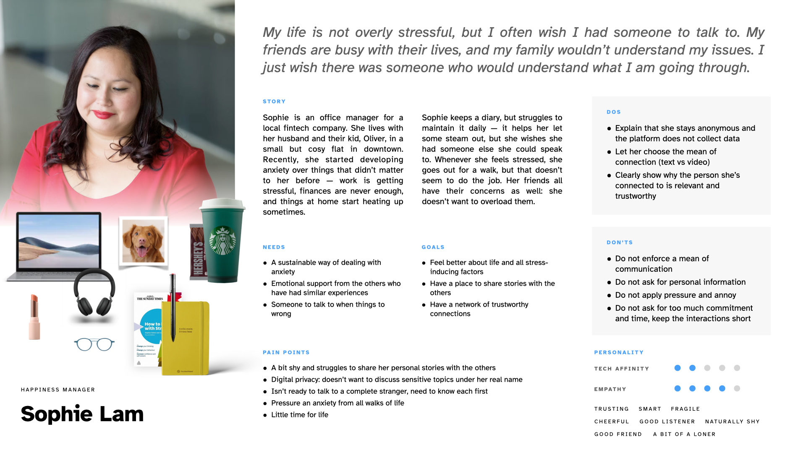
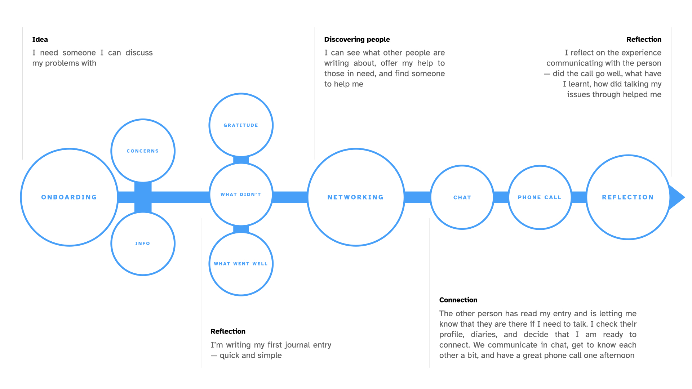
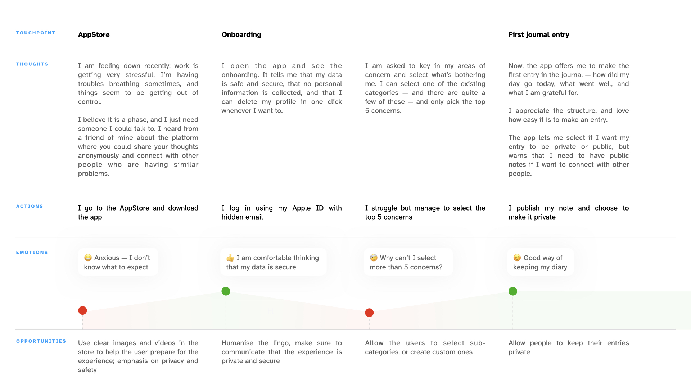
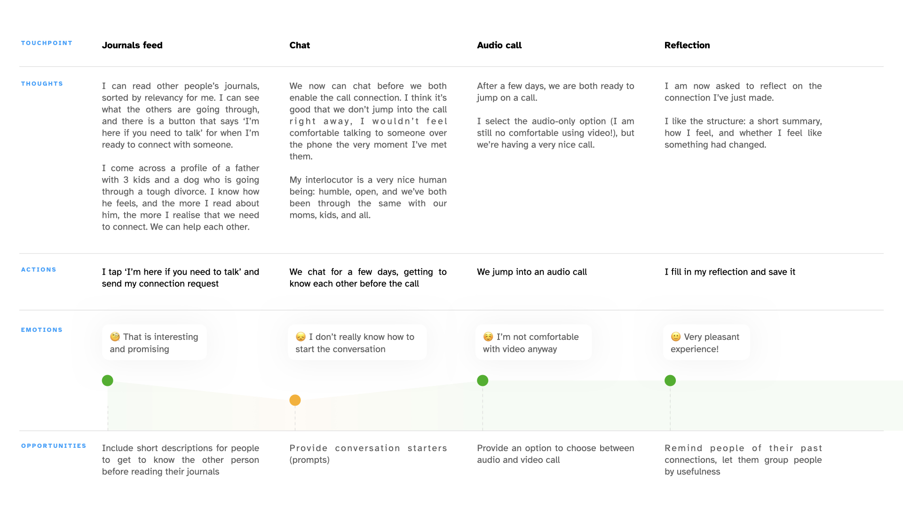
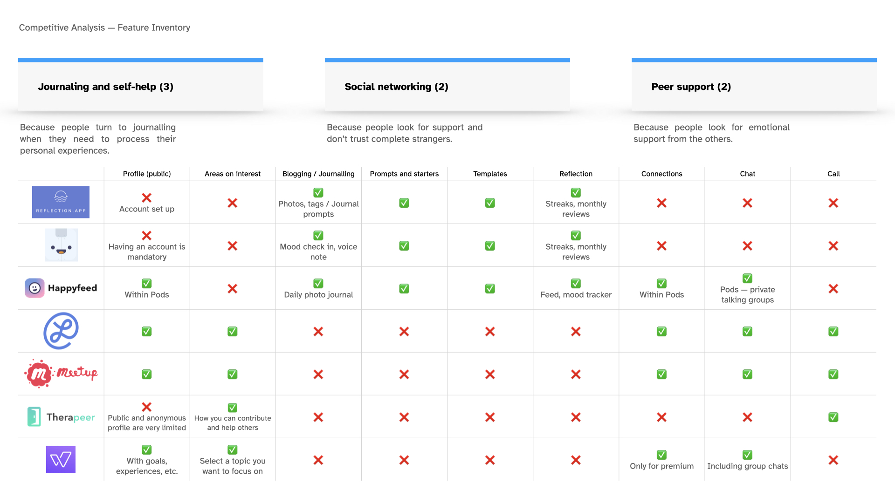
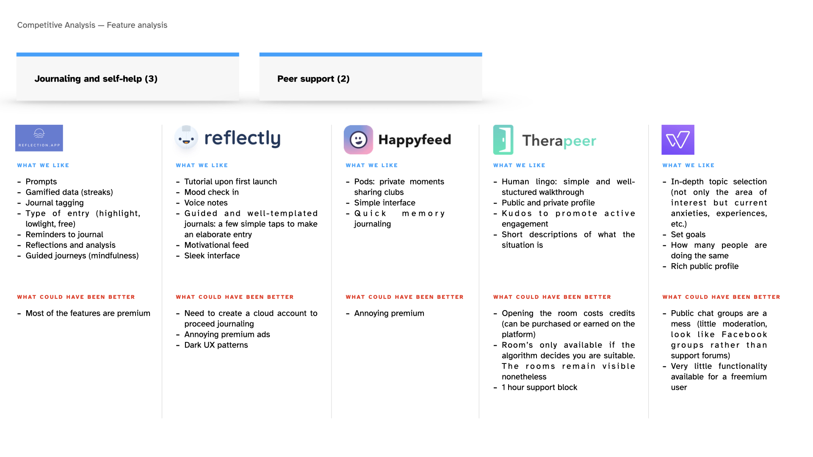

## Challenging the definition of empathy

Researching the definitions of empathy and its role in design, I stumbled upon a very in-depth take: a bit philosophical, but very unorthodox. 

Essentially, empathy is best described as ‘knowing another's present experience’ (Meneses 2011). There exist at the very least two types of empathy — cognitive, the ability to understand other's mental state or perspective, and affective, the capacity to respond with an appropriate emotion. Designers are expected to possess strong cognitive skills — and sometimes, as NNG puts it, ‘share another person’s expressions, needs, and motivations’ (Gibbons 2019) — walk in their shoes, so to speak.

Devecchi and Guerrini (2017), make a strong case that empathy is not a possibility to experience exactly what the other person feels: it is ‘a skill to be with another, be involved in the face-to-face encounter with a concrete Other, acquainting and accepting his/her otherness’. They claim that with this definition of empathy, the approach to empathetic design should shift — from designing WITH empathy to designing FOR empathetic experiences. 

Instead of using empathy as a tool to gain insights, empathetic experiences should be an end to pursue — as the only way to embrace the culture of communication, sociality, encounter. ‘Had one had the same access to the other’s consciousness as to one’s own, the other would have ceased being an other, and would instead have become a part of oneself’ (Husserl 1973). 

To put it simply, we don't have to wear someone else's shoes and assume what they might like, think, do — instead, we need to focus on what makes us different, put our efforts into creating a more collaborative, sustainable, and creative society.

==Takeaway==: instead of attempting to wear my single (and rather narrow) persona's shoes, I should empathise with the audience and respect diversity and creativity. 

## Creative challenge

First, I wanted to thank LJ for pointing me in the right direction with the user interviews — I went back and facilitated a few more sessions to close the gaps and focus not only on what those in need of emotional support required, but also on what my users thought about supporting the others emotionally.

So, here is where my persona was born: I decided to follow Indi Young's advice and removed all demographics data (Young 2016), and instead focused on what my persona needed — the type of wants and aspirations my product could fulfill, the pain points I could relieve. I also recalled Jason Travis's advice (2015) and included some personal items to make my persona a bit more human. ‘Communicating the user experience’ also recommended to include Must Do's and Must Don'ts (Caddick and Cable 2011), so they also helped me enforce my persona quite well.

I then proceeded into creating a Task Map but quickly realised it didn't capture the complexity of the journey well enough: it lacked the human perspective, the emotional side of the experience. I think Wireflow would do a much better job here, helping me capture the experience and provide a good level of interactivity (Laubheimer 2016).

A User Journey helped me solve what persona expectedly couldn't — get a 3D perspective and put the priority on my user (Howard 2014). I included the actions my user takes, the thoughts she is having during and after the experience, and the opportunities that could help eliminate her biggest pain points and make her experience more pleasant.

User journey, part I

User Journey. part II

Concurrently, I was busy analysing the three types of competitors — Journaling and self-help apps, Peer-support platforms, and Networking products. I used feature inventory to outline the feature most of the selected apps had in common. A little thing I noticed was that while some got certain aspects really well (Reflectly, for instance, provided an outstanding journaling experience), none of the competitors provided all key features at the same time (Therapeer, for instance, only focused on peer support, and Wisdo only had discussion clubs and mentorship programmes). I also outlined what those apps excelled at to help me learn from the best.

Completing the persona, UJ, and competitor analysis helped me understand what my platform is set to accomplish for the user, what my user needs, and how technology and design can help make their experience meaningful and pleasant. By combining self-help tools, such as reflections and journals, and peer-support I can create a product that will help those in need to process their experiences in a meaningful way, connect with those who can support them, and assist those in need.

==Takeaways==
- Research is a long and non-linear process: being comfortable with having to pivot is the key to achieving great results;
- Short interview sessions with 5 people yield fantastic insights;
- When creating persona, humanise it, while basing it off of real insights — make it believable, alive, human;
- Focus on what can be borrowed from the competitors, but do not forget to identify new opportunities.

---

#### References

CADDICK, Richard and Steve CABLE. 2011. _Communicating the User Experience: A Practical Guide for Creating Useful UX Documentation_. Hoboken, UNITED KINGDOM: John Wiley & Sons, Incorporated. Available at: [http://ebookcentral.proquest.com/lib/falmouth-ebooks/detail.action?docID=698119](http://ebookcentral.proquest.com/lib/falmouth-ebooks/detail.action?docID=698119) [accessed 21 Jan 2022].

DEVECCHI, Alice and Luca GUERRINI. 2017. ‘Empathy and Design. A New Perspective’. _The Design Journal_ 20(sup1), S4357–64.

GIBBONS, SARAH. 2019. "Sympathy Vs. Empathy In UX". _Nielsen Norman Group_ [online]. Available at: https://www.nngroup.com/articles/sympathy-vs-empathy-ux/ [accessed 7 Feb 2022].

HOWARD, Tharon. 2014. ‘Journey Mapping: A Brief Overview’. _Communication Design Quarterly_ 2(3), 10–3.

HUSSERL, E. 1973. Cartesianische Meditationen und Pariser Vorträge, Husserliana I

LAUBHEIMER, Page. 2016. ‘Wireflows: A UX Deliverable for Workflows and Apps’. _Nielsen Norman Group_ [online]. Available at: [https://www.nngroup.com/articles/wireflows/](https://www.nngroup.com/articles/wireflows/) [accessed 6 Feb 2022].

MENESES, R. 2011. Experiences of ‘Empathy’. Doctoral thesis, School of Psychology, University of  
Birmingham.

My Modern Met. ‘Interview: Jason Travis Captures Personalities Based on What People Carry with Them’, 14 December 2015. [https://mymodernmet.com/behind-the-lens-jason-travis-series-persona/](https://mymodernmet.com/behind-the-lens-jason-travis-series-persona/).

YOUNG, Indi. 2016. ‘Describing Personas’. _Inclusive Software_ [online]. Available at: [https://medium.com/inclusive-software/describing-personas-af992e3fc527](https://medium.com/inclusive-software/describing-personas-af992e3fc527) [accessed 6 Feb 2022].