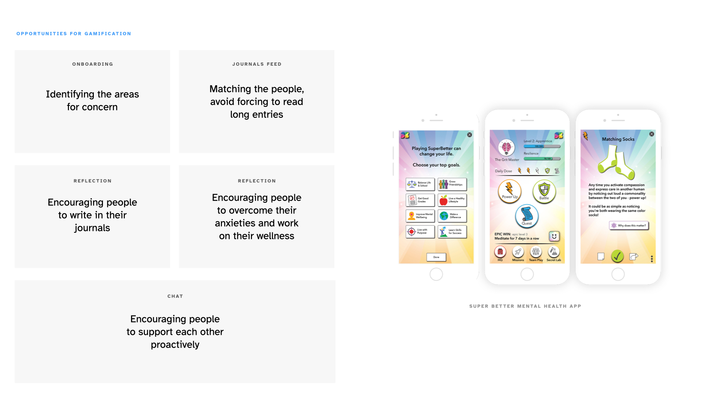
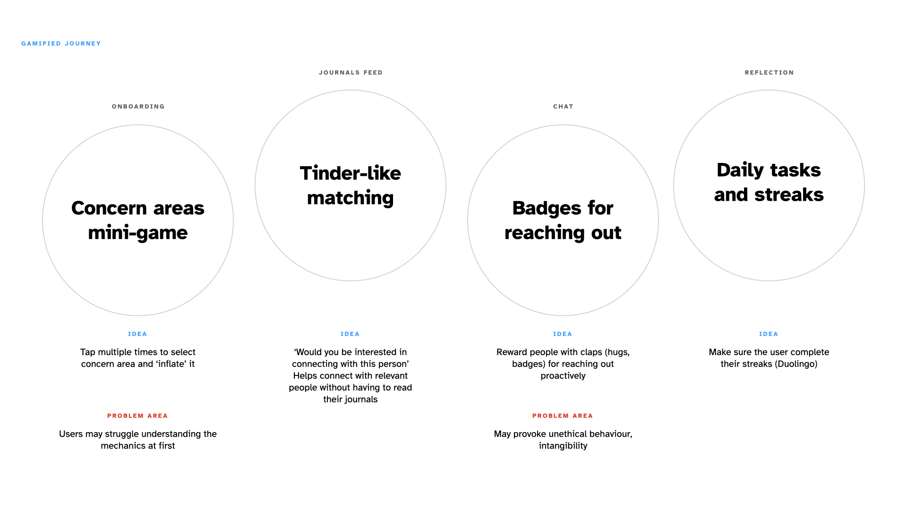
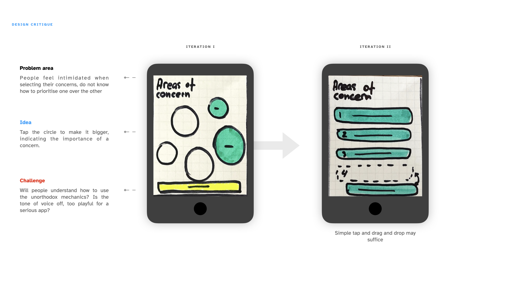
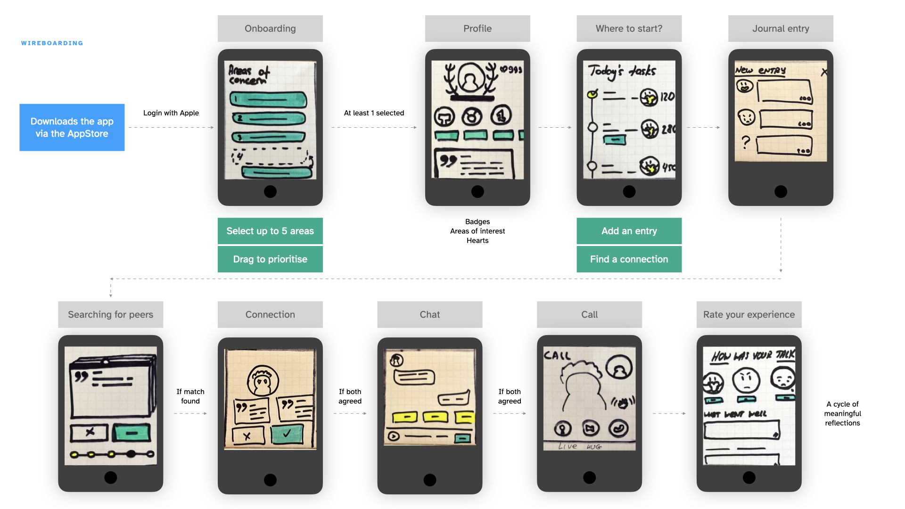

This week's challenge was a lot of fun. I started off by revisiting the interviews from last week to identify areas for improvement, as well as outline the opportunities for gamification that may help solve some of my users' problems:

- How might we help people connect with each other and build trust?
- How might we create long term relationship between our users and the product?
- How might we help people process their experiences in a way that is comfortable and fun?

Marache-Francisco and Brangier in their paper titled ‘From the consideration of Gamification to Implementation’ write about how gamification is more than just badges, colours, and points (Marache-Francisco, Brangier 2015)— gamification is meant to enhance the experience, complement and complete it. In my case, it meant that gamified elements would only take place as supplements to the overall experience, motivating my users, keeping them engaged, and helping complete their jobs to be done.

As I was sketching out the ideas, I realised that doodling the ideas was more than just another exercise as I used to think before (I would often skip sketching and jump straight into wireframing to save time, which often resulted in me wasting time pursuing meaningless ideas). Sketching gets you from facing an entirely mental problem to the point where you clearly see the solution (Schütze et al. 2003) — but it's crucial to iterate and keep improving.

Just like that, I came up with an idea of selecting the areas of concern by tapping on bubbles that would inflate the more you tap them — but a quick guerilla test demonstrated that users has troubles understanding the mechanics, so I replaced it with a simple tap and drag in the next iteration. An idea of sending virtual hugs during the call sounded well in my head, but as I put it on paper, it turned out to look ridiculous — I did, however, preserve it for the next iteration and suggested using it as a way of reflecting on the experience of connecting with another person.

I used the second iteration of sketches to put together a flow chart, so I am about half-way done with the exercise. Next step would be to digitise the low fidelity and keep some level of interactivity, maybe run a quick test with the wireframes later.

[Download this week's activities](./img/02/04.pdf)

==Takeaways==
- Sketching provides an incredible opportunity for exploring ideas at the lowest cost possible, transforms mental concepts into tangible semi-baked solutions;
- Sketching is a vital step when the problem area is unexplored, or when the concept is new: it gives the opportunity to get rid of solutions that would definitely not work early in the process;
- Using paper and sharpies helps truly immerse in the process;
- Gamification may be a good addition to the product, but should not overpower the idea, nor block the users from enjoying the product;
- Design studio activities help uncover opportunities for refinement early in the design process (it is important not to do the exercise alone and always test the solutions, even with a handful of participants, informally).

---

#### References

MARACHE-FRANCISCO, Cathie and Eric BRANGIER. 2013. ‘From The Consideration of Gamification To Its Practical Implementation’ 6.

SCHÜTZE, Martina, Pierre SACHSE and Anne RÖMER. 2003. ‘Support Value of Sketching in the Design Process’. _Research in Engineering Design_ 14(2), 89–97.