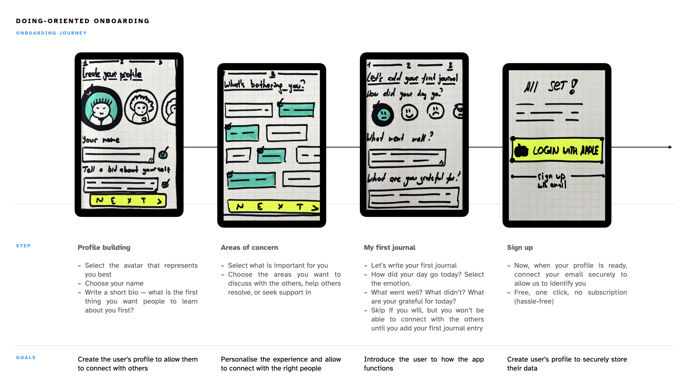
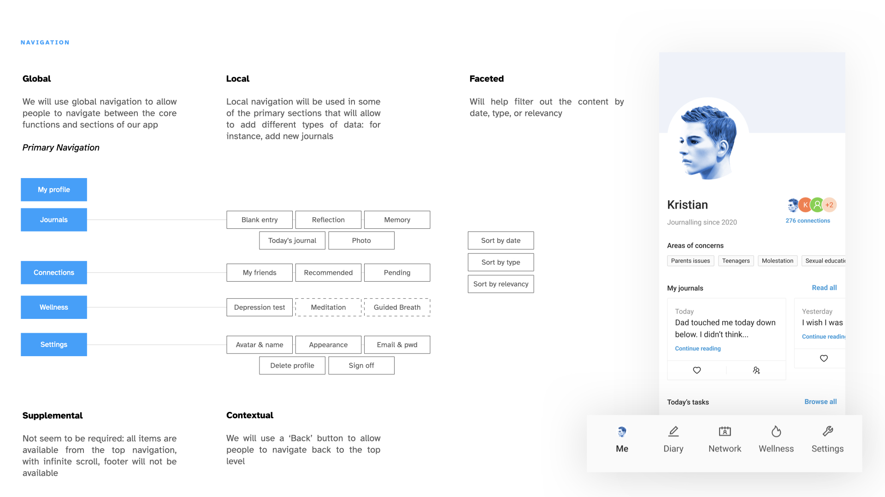
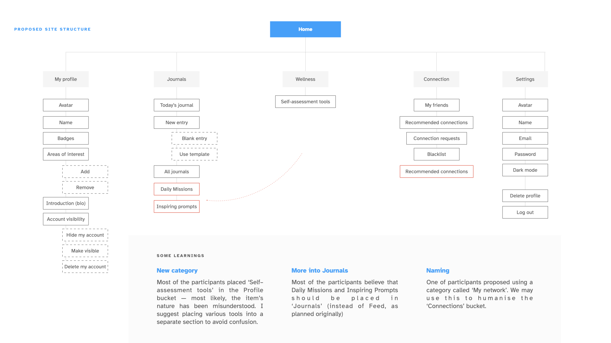

## Understanding the importance of a good navigation

> People hesitate to come back to a website if they had a hard time navigating through it

I think it depends.

There is a lot of evidence that supports that around 88% of consumers are not likely to return to a website after having a bad experience (Toth 2015): we may assume that navigation contributes greatly to the overall perception of usability. There are papers that examine the perceived usability (Yang et al. 2012) and summarise that good navigation is set to help users find the information they need, and that badly designed navigation causes confusion — which may result in customers not willing to return to using the platform (remembering Jakob's law). 

That being said, I think it's important to mention two things. First, often times, customers are forced into using certain websites and applications, government services being the most notorious of all examples. Buie and Murray (2012) provide plenty of great observations of users struggling to find e-services on the government websites. It may be fair to say that people will definitely feel uncomfortable having to open the same Pandora box for the second time, but they will likely not have a choice, regardless of how deeply hidden that driver's license application form is. 

The second example actually highlights a different aspect of the problem: the lack of cultural adaptation and relativity. Some products are designed for a local, mono-cultural market, with very little concern for how a foreign user will perceive it — take WeChat, for example. Pretty much like gov services, WeChat is a default application for messaging (in many cases, transferring money and accessing many services, too), thanks to all the alternatives from overseas being blocked, so it may as well provide the worst experience ever, with the most cumbersome navigation ever imagined, and people will still be forced into using it.

That being said, its navigation (and experience overall) is horrendous from the perspective of a foreigner who does not belong to the app's primary target audience, who seem to enjoy using it. There's a very good paper covering the navigation and usability issues with WeChat and its proposed redesign from the foreigner's perceptive (Zhang 2020). In this case, I may be having a had time navigating it, but others don't: because I don't belong to the target audience and the culture, and they do. 

I think at the end of the day, if your service helps people reach their jobs-to-be-done (especially if it doesn't have an alternative), they can suffer through a couple of design mistakes. Otherwise, they will drop you and find someone who does it better than you.

## Creative challenge

It takes me a bit longer to complete this week's creative challenge, and I am still not done with it yet, currently in the middle of collecting enough Card Sort submissions (you can help by clicking this link).

I started with outlining and refining the onboarding flow and understanding the goals of the process. My product is driven by customer-generated content, so it was important to ensure that users don't feel overwhelmed with the functionality, that the experience is personalised for them, and that they are familiar with the app's value drivers and features. 

As Korovials (2022) suggests, I decided to avoid a generic tutorial and focus on keeping the customer's experience in mind: 

- How do I humanise the experience by helping them build a profile, yet retain anonymity and the sense of security for the customers?
- How do I use explicit categorical personalisation (one when user's experience is defined by their behaviour and preferences (Fan and Poole 2005)) to help drive self–help journey and connect the right people to support each other?
- How do I introduce the user to a rather complex functionality without overwhelming them with boring tutorials?
- Last but not least, how do I make a good first impression and make sure the users enjoy the visual design within 50ms of onboarding (Lindgaard et al. 2006);

I felt like using pen and paper allowed me to create with more freedom and creativity (without being restricted by a tool), I outlined the onboarding flow — from creating a profile to signing up.  As I was sketching, I came up with a few ideas of how the interface can help make the onboarding experience a tad more playful — for instance, the avatars that user selects will be highlighted with colour, whereas the rest will remain greyed out. 

I can already foresee some challenges here, one stemming from a need to maintain anonymity, and another from a need to be creatively sensitive and respectful towards users from different cultures. I will spend more time studying how interfaces are created for different cultures — I managed to find a few studies, including one on how the avatars are designed for users from Arabian culture (Aljaroodi et al. 2020), which clearly illustrates the need to be inclusive, sensitive, and mindful if I am willing to ensure users feel safe and respected while using my platform.

Thinking about what the user will see after the onboarding experience is complete, I started putting together some wireframes. I'm using the Ant Design System for now, which is open source, pretty flexible, and helps me quickly design mid-fidelity mockups. I put together concepts of navigations, but couldn't find the need for supplemental navigation, as the app will most likely not require a safety net, having only one level of depth. 

I am currently recruiting the users for the card sort, and trying to solve a few more puzzles that are on my mind regarding the information architecture:

- How will users from different cultures navigate the app? Will they find it convenient? I will need to make sure I recruit a diverse pool of participants for the UTs down the lane. 
- I tried to ensure that my IA is scalable enough by introducing the Wellness section. However, I am still not sure that it will be an equally understandable home for every new feature that I'm planning to introduce beyond MVP (guided meditation, breath, professional help, etc.). Is my IA scalable enough?
- At the beginning of the onboarding process, I ask the user to select their areas of concerns (i.e. lack of sleep, work related stress, etc.). Should I make a flat hierarchy of concerns and list out all of them (like Therapeer is doing), or use a deep hierarchy and nest them? NNG (Whitenton 2013) says that  flat hierarchy might be a bad idea if many categories are present, so I might either need to shorten the list, or facilitate another card sort for concerns alone.

I will spend my reading week putting together the first wireframes, refining the problem areas, and attempting to recruit more people for the card sort.

==Takeaways==
- There are multiple types of navigation (not only ‘primary’ and ‘secondary’ as I used to believe), and each type can be pre-defined to help guide the user experience;
- Facilitating card sort externally (not with internal stakeholders only) helps uncover some great and unexpected insights;
- You are not your user — ask the others to test your prototype if you want to design the best solution.

---

#### References

ALJAROODI, Hussain M., Raymond CHIONG and Marc T. P. ADAM. 2020. ‘Exploring the Design of Avatars for Users from Arabian Culture through a Hybrid Approach of Deductive and Inductive Reasoning’. Computers in Human Behavior 106, 106246.

BUIE, Elizabeth and Dianne MURRAY. 2012. _Usability in Government Systems: User Experience Design for Citizens and Public Servants_. Elsevier.

FAN, Haiyan and Marshall POOLE. 2006. ‘What Is Personalization? Perspectives on the Design and Implementation of Personalization in Information Systems’. Journal of Organizational Computing and Electronic Commerce - J ORGAN COMPUT ELECTRON COMME 16, 179–202.

KOROVILAS, Pantelis. 2022. ‘How to Design Goal-Oriented User Onboarding in 4 Steps | Appcues Blog’. [online]. Available at: https://www.appcues.com/blog/designing-goal-oriented-user-onboarding [accessed 27 Feb 2022].
  
LINDGAARD, Gitte, Gary FERNANDES, Cathy DUDEK and Judith BROWN. 2006. ‘Attention Web Designers: You Have 50 Milliseconds to Make a Good First Impression! Behaviour and Information Technology, 25(2), 115-126’. Behaviour & IT 25, 115–26.

TOTH, Joseph. 2015. ‘13 Impressive Statistics on User Experience | Inside Design Blog’. [online]. Available at: [https://www.invisionapp.com/inside-design/statistics-on-user-experience/](https://www.invisionapp.com/inside-design/statistics-on-user-experience/) [accessed 20 Feb 2022].

WHITENTON, Kathryn. 2013. ‘Flat vs. Deep Website Hierarchies’. _Nielsen Norman Group_ [online]. Available at: [https://www.nngroup.com/articles/flat-vs-deep-hierarchy/](https://www.nngroup.com/articles/flat-vs-deep-hierarchy/) [accessed 20 Feb 2022].

YANG, Tao, Jared LINDER and Davide BOLCHINI. 2012. ‘DEEP: Design-Oriented Evaluation of Perceived Usability’. _International Journal of Human–Computer Interaction_ 28(5), 308–46.

ZHANG, Qinyan. 2020. ‘WeChat Redesign for Foreigners Living in China from Culturally Adaptive Design Perspective’. In Matthias RAUTERBERG (ed.). _Culture and Computing_. 439–49.