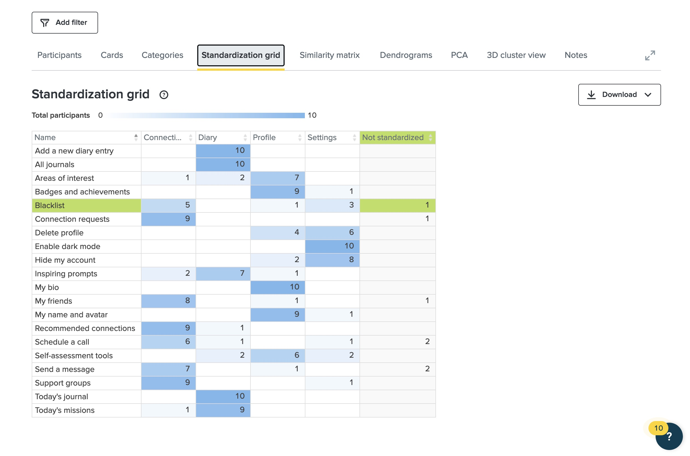
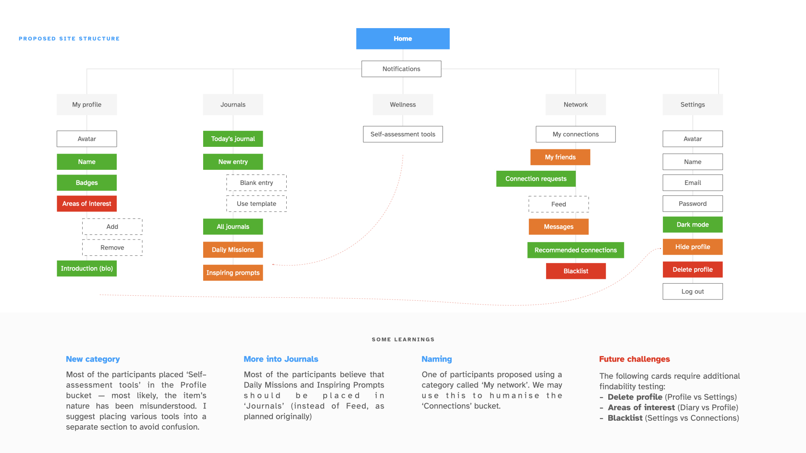
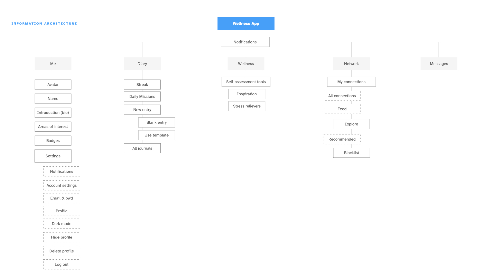
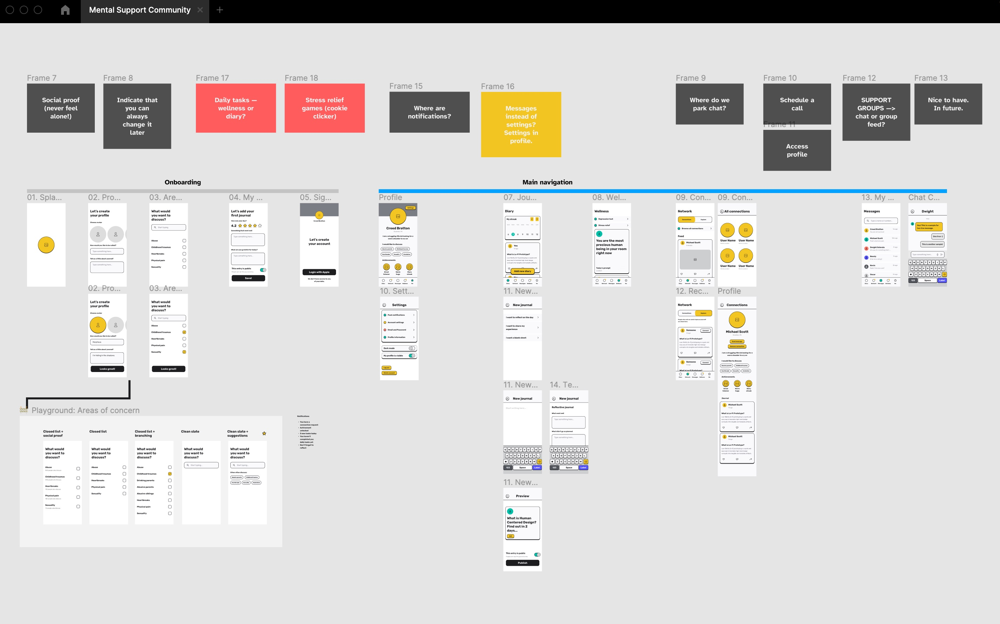

## Improving the experience

I spent this week refining the Information Architecture I have put together over the course of a previous week, as well as designing a set of wireflows and setting a strong foundation for the future prototype.

## Information architecture

I struggled to get more than 16 participants for the Cart Sort exercise, but the results were quite insightful nonetheless. 

I used some time this week to improve the information architecture after reviewing the structure of the application structure once more and identifying some issue. 

1. Communication remains the crucial part of the application, yet, messaging functionality remains hidden in the ’Connections’ sections. It makes more sense to allocate the space for messaging functionality and allow people to access their in-app messenger in one click;
2. Settings take a prominent space — yet, some items were left distributed by the card sort participants between ‘Profile’ and ‘Settings’. It makes sense to merge the two and allow the user to access the global settings from their profile page;
3. One of my card sort participants suggested that the app should provide some stress relief functionality (gamified, potentially). I made sure to include this as a potentially interesting topic to discover.

For the time being, my global information architecture is designed as follows:

I've also outlined some challenges and things to consider while putting together the wireframes:
- A thing to test: will adding a form of social proof help people feel less lonely?
- Feedback from a quick guerilla testing: always make sure to indicate that the user can change any information later!

## Putting together the wireframes

Coleman and Goodwin (2017) recommend approaching prototyping with a few questions in mind, one of these being the cost — it takes longer to implement a product of high fidelity, and at this point of time, I was not sure if I was ready to challenge myself to use an unfamiliar piece of software (I will leave this for the next step) or start designing a high-fidelity prototype right away, as I often do.

I started working on wireframes using a low-fidelity UI library — [Avocado Kit](https://www.figma.com/community/file/1080487556172952383) — to speed up the design process (although I did enjoy the style a lot as well!). Moggridge (2007) recommends using rapid prototyping to make the experience more ‘realistic’, and after completing the exercise, I felt that it helped me not only make it more believable, but also challenge my own initial perception of how the application should function.

Working on the prototype helped me uncover more insights:
- Connections tab, as per original IA, turned out to look overwhelming — I ended up splitting Friends and Messages, making Connections less cluttered;
- How will people be adding Areas of concern — what if they cannot find an area in the closed list? I ended up adding a search bar and a list of popular topics;
- I initially forgot that the journal entry could be private or public — I added a screen to prevent a user from publishing an entry without making sure the privacy setting is set.

==Takeaways==
- Quick and rapid prototyping early in the process allows not only to test and validate the assumptions, but also to identify the weak points in the design, information architecture, product;
- Quick onboarding is important, but make it clear what the user can and cannot do, what information is being requested and why (‘you can always change it later‘);
- MVP is a minimal viable product — any feature that might be removed can be removed.

---

#### References

COLEMAN, Ben and Dan GOODWIN. 2017. _Designing UX: Prototyping: Because Modern Design Is Never Static_. Victoria, AUSTRALIA: SitePoint Pty, Limited. Available at: [http://ebookcentral.proquest.com/lib/falmouth-ebooks/detail.action?docID=4822918](http://ebookcentral.proquest.com/lib/falmouth-ebooks/detail.action?docID=4822918) [accessed 21 Jan 2022].

MOGGRIDGE, Bill. 2007. _Designing Interactions_. 1st edition. Cambridge, Mass: The MIT Press.