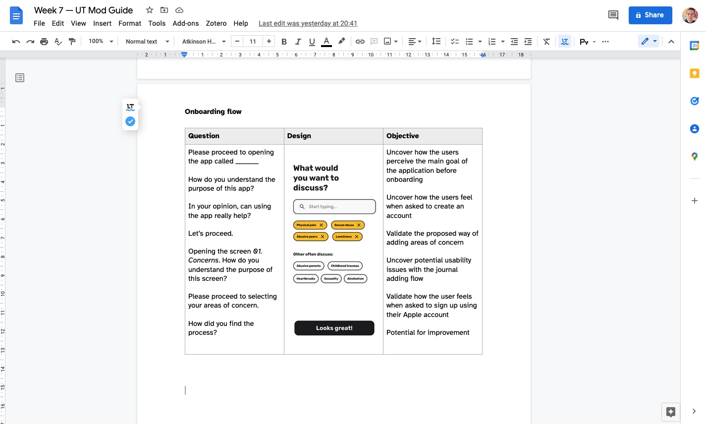
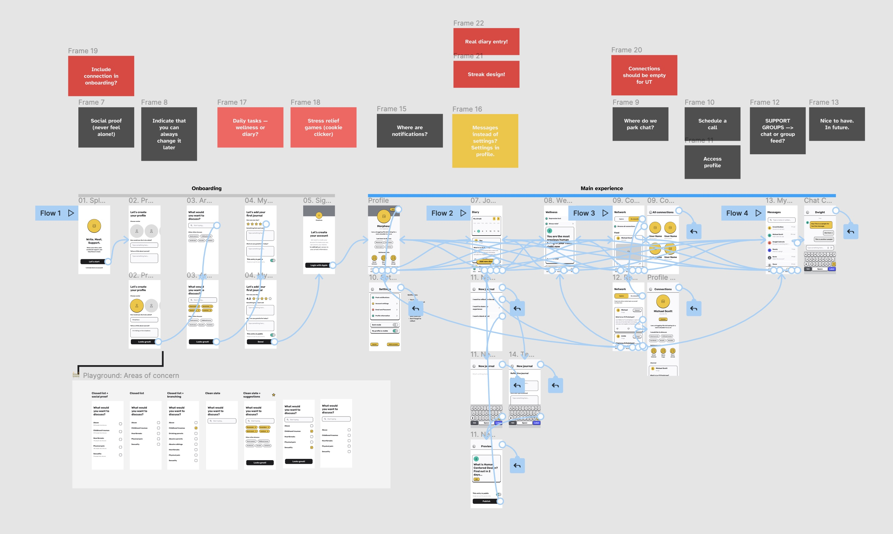
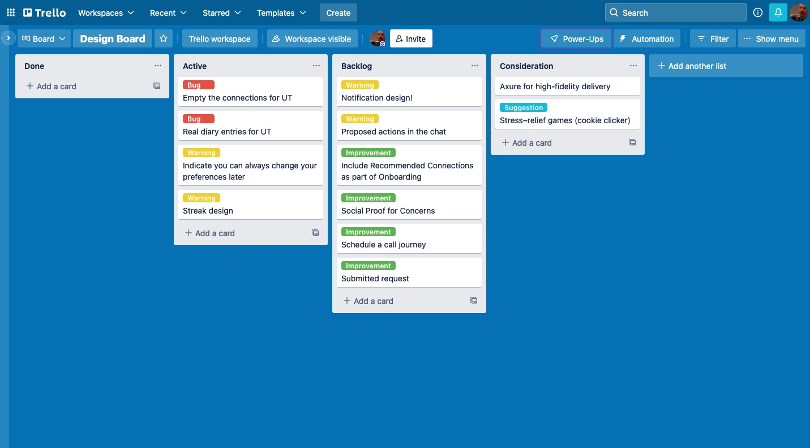

import MentalHealth from "../../src/components/prototypes/MentalHealth.js"

<MentalHealth />

I decided to start by visiting Usability.gov for a usability testing guide. as I started putting together my own guide for the future UT. What I noticed I had missing from the initial setting was the participant profiling — research gurus recommend to include a profile description to make sure you find the right people for testing, so I might need to ensure I have a profile description in the documents.

I then started thinking about the metrics to make sure the findings are not only actionable, but measurable — I decided to go with UMUX, as it provided enough flexibility, did not overwhelm the participants (unlike SUS), and provided quite accurate results (Berkman and Karahoca 2016).

I tried to structure my guide the way that it would encourage me to not only discover issues, but lead to finding solutions (Schade 2013), so I tried framing the questions the way that would help uncover insights, even if I'm not moderating the session. Essentially, [my moderator's guide](https://docs.google.com/document/d/1K4t7pV78pjjacJNf659J5vbPeBO4ljA8dtve-oFvL7Q/edit?usp=sharing) ended up featuring three core questions:
1. Completing a list of concerns the user would like to talk about — would the participants understand the concept, how would they perceive usability, what would be their concerns and expectations?
2. Adding the first reflection — I will both test whether the user understand the navigation, as well as how they would use the app to reflect on their experiences (i.e. would they be using templates?);
3. Adding a connection — once more, I will ask the user to find and connect with a like-minded individual, and test whether they manage to find the related section of the app and complete the task.

Most importantly, I would love to test the perception of the app's value proposition, as well as desirability of the features. Interface is a long shot, so at the moment, I am taking the well-tested approach of testing early (Coleman 2017), often, and dirty, using a medium-fidelity UI kit I found online. 

As for identifying the patterns, I already do have some in the prototype:

- Registration/log in/sign out — to allow people to access their private data, communicate safely, access an account from multiple devices;
- Account settings — to make sure they are open to connect with each other, provide enough flexibility for them to control their appearance on the app and the way the others see them;
- Inline errors — might be required to validate fields (mandatory fields left blank, for instance);
- View toggle — to allow to create public and private journal entries;
- Badges — to display notifications relevant to a certain section;
- Comments is the section that I struggle the most with — I am researching positive enforcement and encouragement, but if I decide to implement comments, I will also have to consider how the comments will be moderated, who will have access to the comments, etc. For the MVP, the features seems to be excessive.

I am also looking around for the visual design guidance — not really in terms of selecting flat against skeuomorphic, but in terms of the emotion my UI is set to evoke: it's well–known that the aesthetics of interface heavily impact the perception of usability (Kurosu and Kashimura 1995), and that playful interfaces have a strong potential in altering the user's behaviour in mental health applications (Rao 2013), so I might need to find an approach that will help my interface remain rather playful and fun, while also retaining the key functionality. I might go with hand-drawn icons and illustrations, pastel colours, soothing visual language.

For now, [my prototype](https://www.figma.com/proto/CsZzRq5V5Ue26HLLrs4q3X/Mental-Support-Community?page-id=105%3A1472&node-id=105%3A1473&viewport=252%2C48%2C0.23&scaling=min-zoom&starting-point-node-id=105%3A1473&show-proto-sidebar=1) is parked in Figma — however, I am actively researching Axure (and AppGyver, as a more advanced version for a future prototype) to allow my users to immerse into the experience: add a real journal, change their user name, use search, etc.

Loranger (2016) recommends to facilitate a guerilla–style test study, for which I might have to recruit a family member or someone from work who did not participate in the interview sessions earlier. 

On a side note, I noticed that the amount of notes started piling up rapidly on my Figma canvas, so I decided to take action and get more organised. Following Rubin's (2012) guidance, I set up a Trello board to organise my workload, prioritise tasks, and park ideas for future implementation.

==Takeaways==
- There is no need to invest in fidelity before the solution is tested at low fidelity (paper or wireframe) — test often and always;
- Writing non-leading questions is challenging, but if you start with outlining your expectations (what you want to learn), you can reverse engineer the right questions.

---

#### References
BERKMAN, Mehmet Ilker and Dilek KARAHOCA. 2016. ‘Re-Assessing the Usability Metric for User Experience (UMUX) Scale’ 11(3), 21.

COLEMAN, Ben and Dan GOODWIN. 2017. _Designing UX: Prototyping: Because Modern Design Is Never Static_. Victoria, AUSTRALIA: SitePoint Pty, Limited. Available at: [http://ebookcentral.proquest.com/lib/falmouth-ebooks/detail.action?docID=4822918](http://ebookcentral.proquest.com/lib/falmouth-ebooks/detail.action?docID=4822918) [accessed 21 Jan 2022].

KUROSU, Masaaki and Kaori KASHIMURA. 1995. ‘Apparent Usability vs. Inherent Usability: Experimental Analysis on the Determinants of the Apparent Usability’. In _Conference Companion on Human Factors in Computing Systems_. 292–3. Available at: [https://doi.org/10.1145/223355.223680](https://doi.org/10.1145/223355.223680) [accessed 9 Mar 2022].

LORANGER, Hoa. 2016. ‘Checklist for Planning Usability Studies’. _Nielsen Norman Group_ [online]. Available at: [https://www.nngroup.com/articles/usability-test-checklist/](https://www.nngroup.com/articles/usability-test-checklist/) [accessed 8 Mar 2022].

RAO, Valentina. n.d. ‘Designing Gamification for Behavior Change in Mental Health: Challenges and Perspectives’ 6.

RUBIN, Kenneth. 2012. _Essential Scrum: A Practical Guide to the Most Popular Agile Process_. 1st edition. Upper Saddle River, NJ: Addison-Wesley Professional.

SCHADE, Amy. 2013. ‘Making Usability Findings Actionable’. _Nielsen Norman Group_ [online]. Available at: [https://www.nngroup.com/articles/actionable-usability-findings/](https://www.nngroup.com/articles/actionable-usability-findings/) [accessed 8 Mar 2022].

Usability Testing Report Template and Examples (2020). Available at: https://xtensio.com/usability-testing-template/ (Links to an external site.) [Accessed 3 December 2020].
