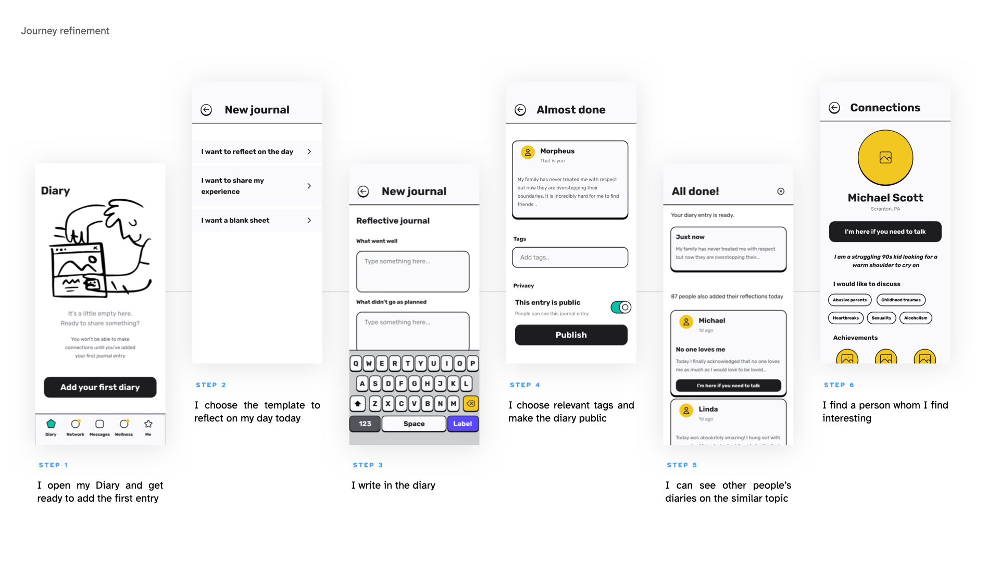
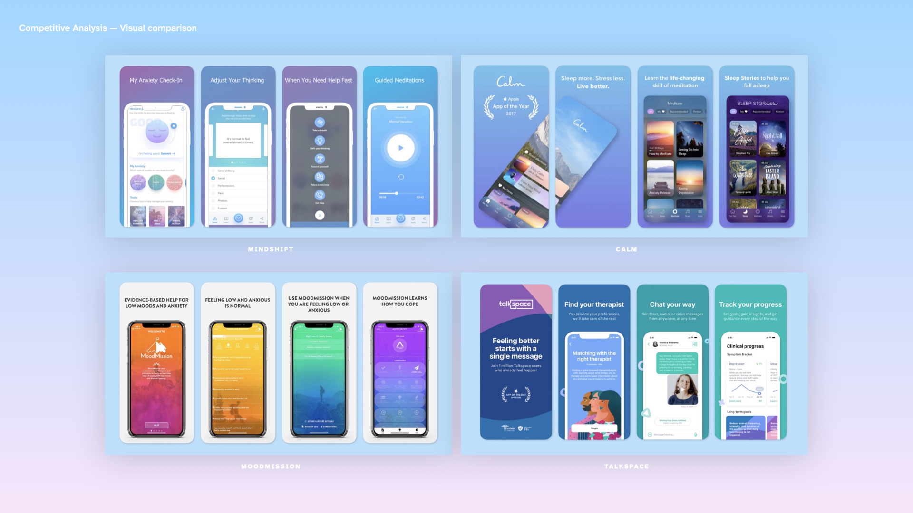
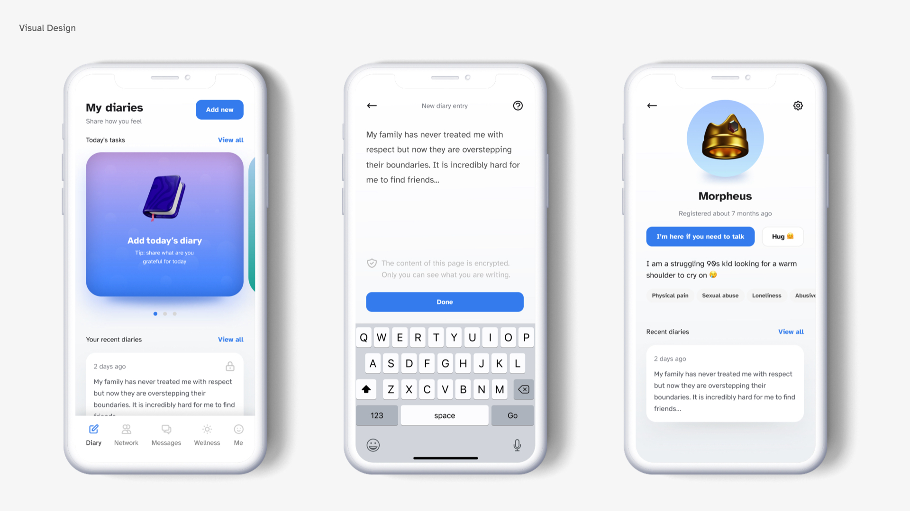

## Research
### Visual design and usability
Our perception of usability stems from the first impression the product makes on us: there is evidence that our brain sets the expectations based on the ‘likeability’ of a product, and tends to stay satisfied with a beautiful product even if you fail to complete your job-to-be-done (Linggaard and Dudek 2002). 

Cognitive bias kicks in if you enjoyed the product within the first 50 milliseconds of the encounter (Lindgaard et al. 2006), which essentially means that if the user falls in love with how your product looks, they can forgive an experience riddled with flaws, and vice versa. It is a very emotional side of our brain that makes the decision — within less than 5 seconds, it memorises the things that stand out, and evaluates the attractiveness of the product (Gronier 2016): it obviously cannot evaluate the experience from a logical perspective, but it does not matter, as long as your unconscious self has made up its mind.

Colours, in particular, seriously influence how the users navigate web pages and perceive usability, as shown by studies (Bonnardel et al. 2011): not only does the colour scheme influence the initial perception, but it also drives the engagement and helps make decisions while browsing the pages. 

Beautiful websites attract the users. Perhaps that is the reason why we think that websites that look as though they were designed in the 90s (Amazon) provide bad usability (which they very often do), and that is partially the reason, for instance, why people don't like using open source software and opt out for paid (but better–looking) apps. 

---

## Prototype development

### Progress since last week

This week, I facilitated a set of **guerilla testing sessions** with a couple of friends to validate and improve the designs:

- The users loved the flow, but didn't quite understand how connections worked;
- They wanted quick reactions, in case they are not ready to connect immediately, but wanted to show their support.

==Quick improvements==:
- Refined the user journey: removed connections and merged functionality with Messenger;
- Added Hugs as a quick function.

### Visual design

This week, I kicked off a little research, trying to answer three questions that would help me create a design that is not only pleasant, but meaningful and impactful:

- **Market analysis**: how do similar applications look and feel like? What is the message they are attempting to convey?
- **Colour research**: are there any colours that impact user's perception (henceforth, impact isability) and emotional state?
- **Typography**: is there I was typography can help make the app more readable, accessible for the wide public?

After exploring what the mental health apps market had to offer, I began noticing certain patterns: pastel colours, soft gradients, smooth 3d icons, apparently to ease the user's tension, create a relaxing atmosphere. For instance Valdez and Mehrabian (1994) review the effects colours have on emotions and behaviour, and surmise that short-wavelength hues, like blue and green, appear more pleasant to the user than yellow and orange. Wilms and Oberfeld (2018) confirm that saturated and bright colours cause arousal, and that achromatic colours cause a short–term deceleration in the heart rate.

When it came to selecting fonts, I came across Atkinson Hyperlegible — a font designed ‘specifically to increase legibility for readers with low vision, and to improve comprehension’, which immediately made my top for the way it tackles similarly looking characters and provides great readability and enough contrast between bold headers and regular font. 

After several iterations, I managed to find a set of pleasantly looking gradients, colours, and icons, and put together three pages from my application — Profile, Diaries, New Entry.

---

## Plans for the future

As part of my future research, I would love to explore **how different colours are perceived in different cultures** to make sure my app is properly localised. I will also need to find a similarly legible font for other markets. 

There are some rather interesting areas to explore — for instance, two-level theory of colour emotion (Ou et al. 2012) — that may shed light on how can I better use colours to influence my users' emotions (for instance, while designing custom 3d icons). 

There is much more research to be done on the **impact of colour on emotions** — it could be used, for instance, to customise the journal appearance to match the user's mood and help colour–mark the entries.

### Future development
- ==Functions==: users should be able to report danger and/or get help if they are in danger;
- ==Focus==: focus on the needs of a persona looking for help, further refine the persona;
- ==Research==: impact of colour on emotions, colour perception in different cultures (Hofstede's framework, contextuality, distance to power, etc.), legible fonts for other markets (Chinese, Cyrillic);
- ==Journal refinement==: provide a solid structure for journal entries to highlight Research, Prototype Progress, Planned Actions, Takeaways, Future Research. Support entries with more visuals for better engagement.

---

#### References

BONNARDEL, Nathalie, Annie PIOLAT and Ludovic LE BIGOT. 2011. ‘The Impact of Colour on Website Appeal and Users’ Cognitive Processes’. _Displays_ 32(2), 69–80.

GRONIER, Guillaume. 2016. ‘Measuring the First Impression: Testing the Validity of the 5 Second Test’. _Journal of Usability Studies_ 12(1), 8–25.

LINDGAARD, Gitte and Cathy DUDEK. 2002. ‘User Satisfaction, Aesthetics and Usability’. In Judy HAMMOND, Tom GROSS, and Janet WESSON (eds.). _Usability: Gaining a Competitive Edge_. Boston, MA: Springer US, 231–46. Available at: [https://doi.org/10.1007/978-0-387-35610-5_16](https://doi.org/10.1007/978-0-387-35610-5_16) [accessed 14 Mar 2022].

LINDGAARD, Gitte, Gary FERNANDES, Cathy DUDEK and Judith BROWN. 2006. ‘Attention Web Designers: You Have 50 Milliseconds to Make a Good First Impression! Behaviour and Information Technology, 25(2), 115-126’. _Behaviour & IT_ 25, 115–26.

OU, Li-Chen et al. 2012. ‘A Cross-Cultural Comparison of Colour Emotion for Two-Colour Combinations’. _Color Research & Application_ 37(1), 23–43.

VALDEZ, Patricia and Albert MEHRABIAN. 1994. ‘Effects of Color on Emotions.’ _Journal of Experimental Psychology: General_ 123(4), 394–409.

WILMS, Lisa and Daniel OBERFELD. 2018. ‘Color and Emotion: Effects of Hue, Saturation, and Brightness’. _Psychological Research_ 82(5), 896–914.