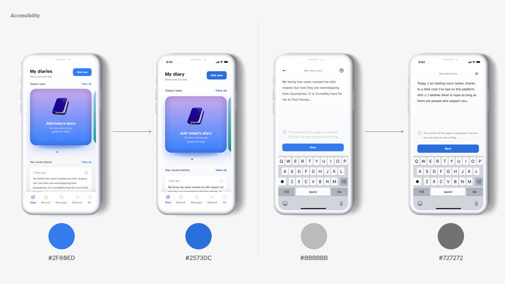

## Research
### The importance of responsive design

I find a quote from a literature review I stumbled upon while researching the topic to be quite relevant: responsive design is a digital world's analogue of ‘architectural design, whereby a room or space automatically adjusts to the number and flow of people within it’ (Mohamed and Ondago 2014). So, much like the architects who erect one building to host many visitors, designers employ responsive design to allow many users on one platform or application.

At the same time, people tend to confuse responsive design for adaptive and mobile–first design, limiting the very philosophy to just a handful of gadgets. I've worked with a few clients who would demand I show them how their website would look on mobile, despite the majority of their users browsing it from desktops. They would ask to design mobile first, which to me would make even less sense. Mesibov and Levin (2017) make a very good claim that this approach should be replaced as inadequate with device–agnostic design: we've got so many devices and use cases that journey–driven responsive design is the only way to go — making sure every user, regardless of their screen resolution and device type — can navigate our product.

So, in my view, responsive design is a basic requirement, a minimum baseline, and a right — for every visitor, on every device to have uninterrupted access.

---

## Prototype development

This week, I am addressing the issues from the previous week (mostly revolving around accessibility), as well as completing the first journey for the Product Desirability Testing. I will also try to facilitate a few guerilla sessions in between to quickly iterate and refine the journey.

I initially did not plan for the application to be designed for anything other than iOS (for security reasons, as it relies on ‘Login with Apple’): however, reading the entry from Smashing Magazine (Babich 2017) on grids made me think of how to apply modular grid to my design and make sure tablet users are not left out, as well as how to retain the future possibility for scaling the platform up to becoming a PWA. 

I'm using a classic 8-point grid (Spec) to align, organise, and scale the elements within the Design System, as shown below. In an essence, the current set of elements is flexible enough to provide a single column layout for mobile and 6 column layout for tablets. I'm making sure to use consistent spacing (8px, 16px, 24px, 48px), but keeping the grid flexible. Compared to the initial coloured wireframes, the information is much better organised, more fits on the screen without cluttering it, and the hierarchy is clear. 

I did make a lot of changes to font sizes (I used type-scale.com to generate font sizes that look organic) and colours (Contrast and a11y plugins pointed out to the accessibility issues, so I dimmed the bright colours and brightened up the greys). 

---

## Learnings
- Asking for feedback during the breakout session and a small group meeting helped refine the UI really well, specifically notice the accessibility issues. Ask for feedback and review early and frequently to notice anything you could not spot early;
- Unusual patterns do not convey bad usability (tilt–scrolling). Research how to use them properly, and apply to enhance the experience where required.

---

## Plans for the future

There is still much to be done (and tested), but for the next couple of days, I would love to focus on:

- **Finalising the journey** and facilitating testing sessions (I might have to resort to using remote testing so it is a good time to learn how to use Maze);
- Exploring a **more scalable design language**: for instance, I will need to tweak the font size for a web version of the app. I also need to document how gradients are being used in various scenarious, and if there is any coding to their meanings (for instance, purple for diaries, green for connections, etc.);
- **Accessibility features**: how do I make the experience and the UI more accessible (for instance, introduce handwriting or voice note taking, a high–contrast version with larger fonts for web). It applies more to the web version than to an iOS app, but there are some areas left to explore — for instance, making sure that the minimal clickable area of 44px is ensured;
- **Micro–enhancements**: custom 3d icons (a great opportunity to finally learn Blender!), micro–animations (time to open AE), for better engagement (I will put it in backlog for a while).

### Scrolling behaviour and unusual patterns
As part of this week's research, I came across a number of studies on tilt–scrolling as a mean of decreasing the scrolling fatigue which naturally occurs when scrolling through large chunks of text, and providing a better single-handed experience (Liu et al. 2019). This may come in handy when designing the reading experience, as well as providing self–help methods I mentioned before (mini–games, clickers, etc).

I am planning to expand the research and explore how various scrolling and interaction techniques, outside of conventional tap and scroll, can be utilised to help improve the user experience of my app.

---

#### References

‘8-Point Grid’. 2022. _Spec.fm_ [online]. Available at: [https://spec.fm](https://spec.fm) [accessed 23 Mar 2022]. — Why am I using a 8 pt grid — a soft grid to maintain consistency and visual hierarchy, allow for scalability 

BABICH, N. 2017. ‘Building Better UI Designs With Layout Grids’ [online], _Smashing Magazine,_ 20 December. Available at: [https://www.smashingmagazine.com/2017/12/building-better-ui-designs-layout-grids/ (Links to an external site.)](https://www.smashingmagazine.com/2017/12/building-better-ui-designs-layout-grids/) [Accessed 23 December 2020].

LIU, Chuanyi, Chang LIU, Hao MAO and Wei SU. 2019. ‘Tilt-Scrolling: A Comparative Study of Scrolling Techniques for Mobile Devices’. In De-Shuang HUANG, Zhi-Kai HUANG, and Abir HUSSAIN (eds.). _Intelligent Computing Methodologies_. 189–200.

MESIBOV, Marli and Jason LEVIN. 2017. ‘Mobile First Is Just Not Good Enough: Meet Journey-Driven Design’. _Smashing Magazine_ [online]. Available at: [https://www.smashingmagazine.com/2017/02/mobile-first-is-just-not-good-enough-meet-journey-driven-design/](https://www.smashingmagazine.com/2017/02/mobile-first-is-just-not-good-enough-meet-journey-driven-design/) [accessed 23 Mar 2022].

MOHAMED, Abdulrehman A and Collins ONDAGO. 2014. ‘Responsive Web Design InFluid Grid Concept Literature Survey’ 10.