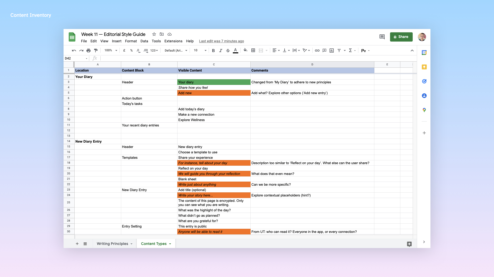
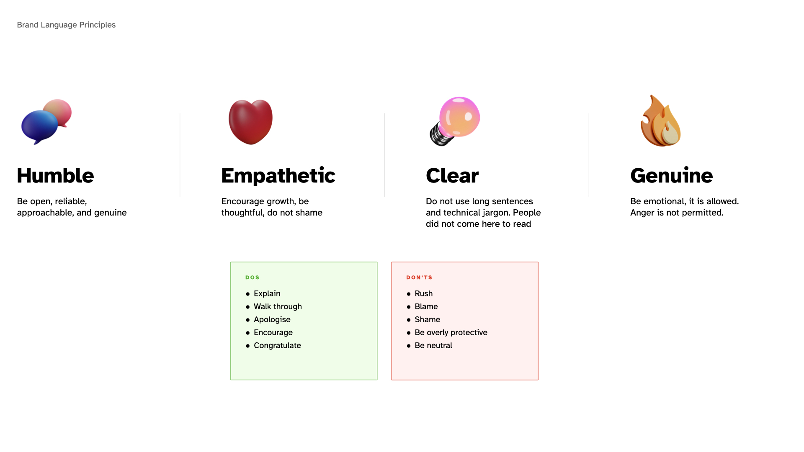
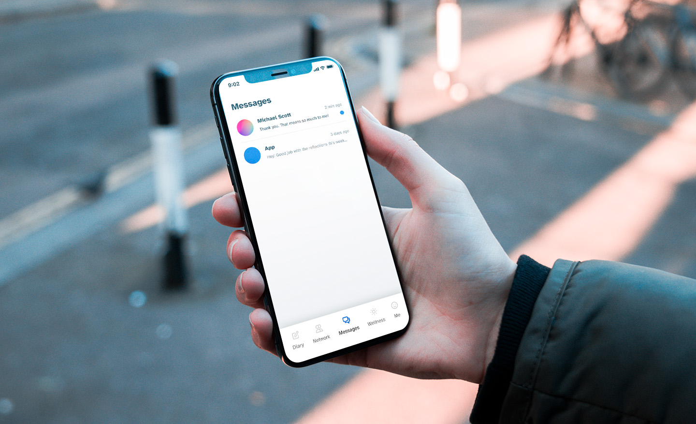
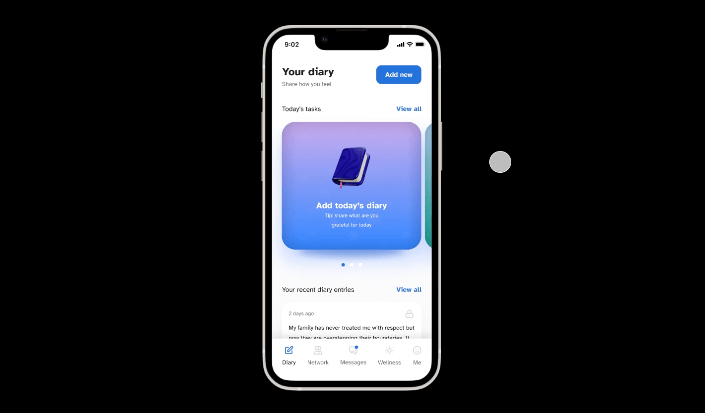
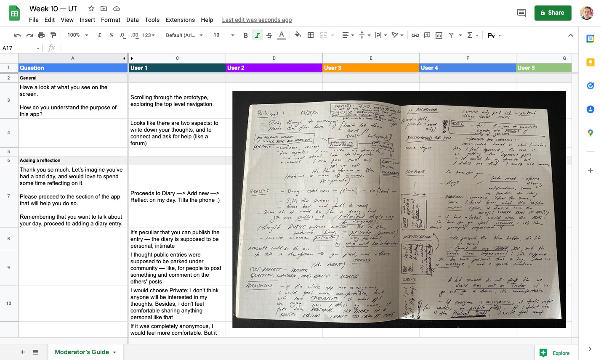
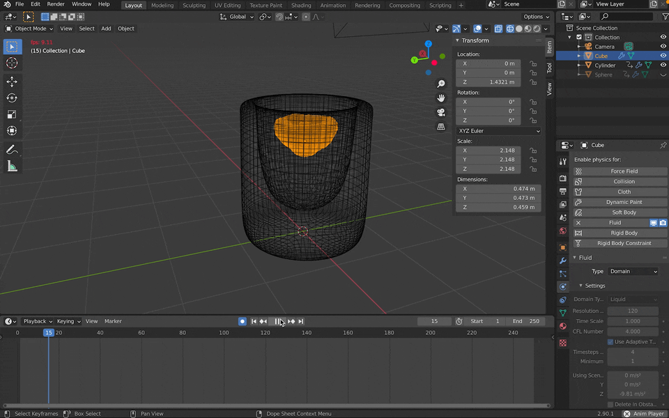

## Project State
import MentalHealthTwo from "../../src/components/prototypes/MentalHealthTwo.js"

You can try the latest prototype here:
<MentalHealthTwo />

## UX Writing
As outlined by Lauer and Brumberger (2019), the content writer is a process revolving around creating and — most importantly — repurposing content for various platforms, often under a lot of pressure. Having not yet considered how the content of my application will be reused and scaled up, I believe I have unintentionally taken a pseudotransactional approach (Spinuzzi 1996) at writing the copies: instead of thinking about the end user, I placed the assignment at the centre of the writing process.

In order to fix that and ensure that my writing is transactional (henceforth, aids in creating the value for the end users), I decided to create and evaluate the content inventory. Following Veen's (2002) advice, I opted for manually putting together a sheet of all content. As demonstrated in the figure below, I have identified quite a few areas that did not align with the brand's tone of voice, or straight away failed to communicate the intention.

Keeping in mind that content strategy is a discipline of defining not only the type of content, but also the reason for it to appear the certain way in the first place (Halvorson 2006), rather than facilitating inventory from time to time, I should make tracking, refining, and realigning the content a continuous habit.

Having content writing guidelines in place will help do so: well–aligned with the goals of the app, the guide will help keep the content consistent, and the experience — smooth and pleasant.

## Service Design

In a paper titled ‘Service Design for Experience-Centric Services’, Zomerdijk and Voss (2010) describe the 6 core pillars of service design — from providing the user with a series of cues (implemented in the form of hints in my application) to engaging the customers (when employees actively keep the visitors entertained). Since every product comes with an experience, the takeaway impression that is formed when customers come in touch with the product and service (Carbone and Hackel 1994), it is important to make sure that every user of the app receives the best possible service experience, even when not actively embarked on the primary journey.

In order to ensure a more holistic approach, a few changes were made to the prototype. As such, I have implemented a chatbot of sorts instead of a consolidated notification centre — to reach out to customers on behalf of the app (customer engagement), create the illusion of a real person communicating alongside other people (what Zomerdijk and Voss call ‘fellow customer’), and provide a more human experience of receiving updates in general. This way, the ‘Messages’ section of the app will never stay void (similar to how in Disneyland the queue is often associated with the quality of a ride).

## Prototype updates

In order to facilitate a journey desirability testing, I put together a prototype of a main journey: from adding the first journal to making the first connection.

The prototype is fully functional, except some secondary pages outside the main journey. I will take time next week to further refine it and include the missing blocks.

## Testing

I began facilitating journey desirability testing sessions earlier this week on two fronts — in–person and asyncronously, over [Maze](https://t.maze.co/83745174), to make sure I cover a diverse pool of participants and gather different data. Maze, to my dismay, yielded only the very basic of results, confirming the paths were outlined well enough, but did not provide enough depth into how the participants truly felt about using the platform.

From the first testing sessions, I managed to gather plenty of useful insights — the users in general value the usability quite highly, but hesitate to use certain features (like publishing the entries for the general public to read), or call as opposed to chatting with strangers. 

In the next few weeks, I will continue testing and validating my assumptions, using the [Moderator's guide](https://docs.google.com/document/d/1K4t7pV78pjjacJNf659J5vbPeBO4ljA8dtve-oFvL7Q/edit) I put earlier and kept updated during the design phase.

## 3D assets

One thing worth mentioning revolves around the little gamification feature that I decided to implement, and that received praises from the colleagues, the student peers, and testing participants. The feature was roughly put together as an early prototype, and allowed the user to rank their day by emptying the glass by tilting the phone. 

During the testing, literally every user would tilt the phone sideways (as opposed to intended back and forth), which made me rethink and redesign the behaviour, as well as add a ‘Refill’ button. Users would also react visibly positively to the feature, which made me invest more efforts into designing it. 

Reflecting back on my initial goal of mastering a new tool and practicing motion and visual design, I decided to model and animate a realistic glass to implement at the final stage. I used Blender to model a glass and animate the initial interaction of water spilling over.

After a few iterations, I managed to make the glass look slighly more realistic. The water, however, remained quite unrealistic. I will need to further explore how such things are being implemented in Blender, and try again.

## Future research and development

In the next weeks, I would love to facilitate more reseach on how to improve my content writing practices, specifically around putting together the editorial guidelines, as well as implementing a more robust system of tracking than a static Excel sheet. I did see a fellow peer use Airtables, that might be a good start. I could benefit from further researching how to improve the aspects of the service that are not visible to the end user: the dramatic structure of the customer journey, the backstage experience. 

There is much to be desired from the usability testing sessions — for instance, due to not having a designated note–taker, I was forced to take notes during the interview, which inevitably harmed the quality of the insights. For the following interviews in the series, I shall record the audio of the sessions, or bring an assistant to help take notes.  

Finally, researching the 3d animation and modelling techniques, as well as studying the real water spilling over, could help me create a more realistic experience for the users.

==Takeaways==
- Testing even the most refined (seemingly) solutions can yield a great amount of insights;
- Moderated testing is capable of providing outstanding insights, unmoderated is great for evaluating the proposed journeys and usability;
- Do not be afraid of using new software and trying something completely new (Blender). When you move step by step, every goal is reachable.

---

#### References

CARBONE, Lewis and Stephan HAECKEL. 1994. ‘Engineering Customer Experiences’. _Marketing Management_ 3.

HALVORSON, Kristina. 2006. ‘A List Apart: Articles: The Discipline of Content Strategy’. _A List Apart_ (274), 4.

LAUER, Claire and Eva BRUMBERGER. 2019. ‘Redefining Writing for the Responsive Workplace’ 31.

POLAINE, Andy, Lavrans LØVLIE and Ben REASON. 2013. _Service Design: From Insight to Implementation_. Rosenfeld Media.

VEEN, Jeffrey. 2002. ‘Doing a Content Inventory (Or, A Mind- Numbingly Detailed Odyssey Through Your Web Site)’. _Adaptive Path_ 2.

ZOMERDIJK, Leonieke G. and Christopher A. VOSS. 2010. ‘Service Design for Experience-Centric Services’. _Journal of Service Research_ 13(1), 67–82.

