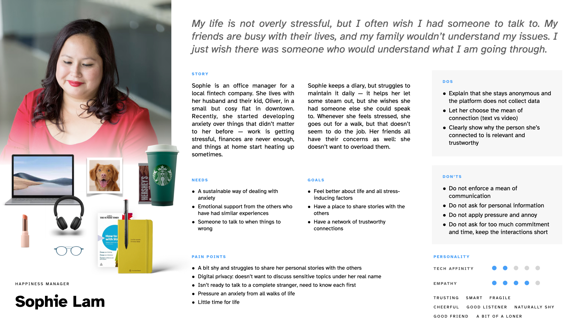

## Research
### The art of Storytelling

Storytelling is a crucial part of communicating a cohesive experience. It helps relieve the pressure on memory through visualisation, bringing together research, analysis, and ideation (Peng 2017). Facilitating an inventory helped me visualise how some of my screens fail to support the notion — for instance, the screen that offers the user to select a template. I should consider supporting the selection with visuals, as well as promoting frequently used templates. 

The important aspect of storytelling as a tool that helps ignite the discussion and help improve the overall experience (Peng and Matterns 2016) is apparent when it comes to facilitating guerilla research studies. Stories help us see the experience clearly: actions often contradict words, it is through listening and observing that we make our decisions (Quesenbery 2010). 

This explains, for instance, why a call feature, proposed by the app, was met for such hostility by my unmoderated testing participants (literally everyone commented that they were not ready to connect with strangers), but did not yield such a negative responce during face–to–face sessions, when the participants were offered with a background (that you and the other person have been in touch for a while). This helped me reframe the feature proposition — from unlocking a feature to helping connect someone who is already quite close to one another.

### Articulating design decisions
Having read a great book by Tom Greever (2020) titled ‘Articulating design decisions’, I couldn't help but reflect on whether my design is meeting my primary user's goals and expectations.

I covered the questions of accessibility, following common design patterns, and delivering a feasible experience (despite being tempted to introduce more fantastic features!) in the previous entries. 

## Suicide prevention
This week, I dedicated some time to research how machine learning can be used to capture emotions and depressive tendencies. As many of my testing participants pointed out, it was rather crucial for them to know that the application provided safe and secure environment — henceforth, making ensuring it can detect dangerous situations was of high importance. 

Desmet and Hoste (2018) point out that, since many people with suicidal tendencies often discuss their condition on social media, their mental state can be detected by using a combination of linguistical and behavioural techniques that will analyse not only the keywords, as initially proposed in my early designs, but the entire user profile in a long run, bypassing misspelling, abbreviations, and other natural limitations.

Leive and Freire (2017) second that, pointing also that people use social media as a way of relieving their pains and suicidal thoughts. 

This made rethink the way my prototype behaved, and implement a new screen that will get triggered after the entry was published, offerring warm and non–intrusive support.

---

## Prototype development
### Reflection

Reflecting back on my persona, I was trying to answer whether my app provided adequate pain relievers and gainers for them:

1. A sustainable way of dealing with anxiety — delivered through self–help tools and journalling, as well as connection;
2. Emotional support from people with similar experience — delivered through networking and connection;
3. Someone to talk to — through messenger and audio chats.

I was also mindful of the don'ts:

1. The mean of communication is not enforced (you can react with a hug, reach out to a person via text, or give a call);
2. No personal information is requested;
3. No pressure is applied — in fact, notifications are concealed as private messages, and no anoying pushes are sent;
4. No commitment — the journeys are short, quick, and pain–free.

However, I am yet to discover a sustainable way of making sure the user can visualise their progress, set goals

### Usability testing
I facilitated some more testing sessions to learn that:
- People look for a quick escape during long journeys (such as adding a reflection), so implementing a close button helps relieve pressure;
- Call functionality may seem intrusive and dangerous at first, but when put in context, people appreciate the functionality. I made sure to fix the copy and update the prototype to reflect the state;
- A number of people pointed out that they would turn to guided meditation as a mean of self–help, so I decided to introduce meditations as part of the Wellness journey.

I have achieved some great progress in designing the high–fidelity prototype:

- Completed the onboarding process — from splash screen to creating an account;
- Thanks to LJ's feedback, I learnt that constraints can be used to make the navigation stick at the bottom, without having to place it in the middle of the screen;
- In order to better communicate the value of the app and showcase its capabilities (such as adding a journal entry), I decided to prepare a prototype of higher fidelity. I am currently working on a prototype using Protopie, which supports input, device tilting, and more;
- In order to test desirability, I have put together a small website in Webflow (learning how to use Webflow at the same time) to later launch it, and discover how many people will be willing to join Alpha testing.

---

## Plans for the future
- Visualisation and storytelling: how might I improve the way my app communicates with the user? For instance, what kinds of messages will it be sending, if push notifications do not exist? Can I visualise the templates better?
- Conveniency: some people pointed out they were not sure they would feel comfortable typing their diaries in on a phone screen. Is it possible to implement other ways: photo, hand writing, voice diary?
- Safety: I am working on injecting a few components that will help communicate that the app is 100% anonymous and secure.
- 3D: I am yet to complete my 3d icons in Blender, the progress there, unfortunately, is very limited.

At the end of the day, the work is almost complete. Except for a few minor changes, a high–fidelity prototype in Protopie, and a fake door website, the project is just about ready to be presented as a complete case, with plenty of room and opportunities for future development and growth.

---

#### References

DESMET, Bart and Véronique HOSTE. 2018. ‘Online Suicide Prevention through Optimised Text Classification’. _Information Sciences_ 439–440, 61–78.

GREEVER, Tom. 2020. _Articulating Design Decisions: Communicate with Stakeholders, Keep Your Sanity, and Deliver the Best User Experience_. 2nd edition. Beijing Boston Farnham Sebastopol Tokyo: O’Reilly Media.

LEIVA, Victor and Ana FREIRE. 2017. ‘Towards Suicide Prevention: Early Detection of Depression on Social Media’. In Ioannis KOMPATSIARIS et al. (eds.). _Internet Science_. 428–36.

PENG, Qiong. 2017. ‘Storytelling Tools in Support of User Experience Design’. In _Proceedings of the 2017 CHI Conference Extended Abstracts on Human Factors in Computing Systems_. CHI ’17: CHI Conference on Human Factors in Computing Systems, Denver Colorado USA, 6 May 2017, 316–9. Available at: [https://dl.acm.org/doi/10.1145/3027063.3027121](https://dl.acm.org/doi/10.1145/3027063.3027121) [accessed 4 Apr 2022].

PENG, Qiong and Jean-Bernard MATTERNS. 2016. ‘Enhancing User Experience Design with an Integrated Storytelling Method’. In Aaron MARCUS (ed.). _Design, User Experience, and Usability: Design Thinking and Methods_. Cham: Springer International Publishing, 114–23. Available at: [http://link.springer.com/10.1007/978-3-319-40409-7_12](http://link.springer.com/10.1007/978-3-319-40409-7_12) [accessed 4 Apr 2022].

QUESENBERY, Whitney and Kevin BROOKS. 2010. _Storytelling for User Experience: Crafting Stories for Better Design_. Rosenfeld Media.